# Continuous Zero Trust Enforcement over a FAPI 2.0 Baseline: What It Adds, What It Costs, and Where It Fails

**Highlights**

- FAPI 2.0 sender-constraining alone ends token replay and theft, for +0.60 ms
- Continuous Zero Trust changed the outcome of one of six attacks, then lost it
- An adversary who merely slows down defeats it 30/30; the baseline result was 11/30
- The unforgeable device signal was priced 0.05 below the decision threshold
- Policy round trip costs 9.39 ms; DPoP verification costs 0.19 ms

**Abstract**

FAPI 2.0 mandates sender-constrained access tokens, which ends network replay and reuse of tokens stolen without their key. This reframes an unanswered question: what does a further layer of continuous, context-bound Zero Trust enforcement add to an already FAPI 2.0-correct Open Banking deployment, and at what cost? We build a reproducible synthetic testbed — a Basiq-isomorphic resource API, a Keycloak identity provider on the FAPI 2.0 DPoP profile, and a controller performing per-request device-binding, telemetry, rule-based risk scoring and adaptive allow/challenge/deny — and evaluate a bearer baseline, a FAPI 2.0 baseline and continuous enforcement under one attacker suite. Sender-constraining alone takes replay and token theft from 30/30 successes to 0/30 for a median 0.60 ms. Of the three attacks it cannot stop, continuous enforcement changes one: account takeover from a new device, 30/30 to 11/30 (risk difference −0.633, 95% CI [−0.806, −0.461]). Per-request records show those successes to be a sliding-window artefact: the one signal the adversary cannot forge is priced 0.35 against a 0.40 threshold and is inert alone. An adversary who paces their requests and mimics context — both already in the threat model — succeeds 30/30. Recalibrating the threshold to 0.30 refuses that adversary completely at identical measured friction, locating the failure in the operating point; for device-resident abuse no threshold works, as the only applicable rule fires on all legitimate traffic. Enforcement costs 6.2 ms median and 27.6 ms p99 (Cliff's δ = 0.58), 11.5 pp CPU, and refusal of 7.4% of legitimate requests. Cryptography is 1% of the cost; one policy round trip is 55%.

**Keywords:** Open Banking; FAPI 2.0; DPoP; Zero Trust; continuous authorization; account takeover; adaptive adversary; empirical security evaluation.

---

## 1. Introduction

Open Banking exposes consumer-permissioned financial data through standardized APIs under regulatory mandates including the EU's revised Payment Services Directive (PSD2) [1] and Australia's Consumer Data Right [2]. The resulting architecture distributes access across heterogeneous devices, networks and accredited third parties, and a recurring concern in both formal and empirical work is that session- and token-level compromise remains viable even where strong cryptography is deployed [3, 4, 5, 6].

The industry response has converged on the Financial-grade API (FAPI) 2.0 Security Profile, which reached Final status in February 2025 [7]. FAPI 2.0 composes Pushed Authorization Requests [8], PKCE [9], short-lived tokens, and — the provision that matters here — sender-constrained access tokens via either mutual TLS [10] or DPoP [11]. Sender-constraining binds a token to a client-held key and requires a fresh proof-of-possession on every call, so a token stolen without its key is unusable. This directly defeats the network-interception and browser-storage-exfiltration adversaries that motivate much of the Open Banking security literature. It is also no longer aspirational: Keycloak 26.4 promoted DPoP from preview to full support and ships `fapi-2-dpop-security-profile` client policy profiles that pass the FAPI conformance suite [12].

This creates a question that, to our knowledge, has not been answered with measurement. Recent architectural proposals apply Zero Trust principles [13, 14] to banking API gateways, decomposing the design into Policy Decision, Enforcement and Information Points and arguing for per-request, context-aware authorization [15]. Much of the security benefit such proposals claim — defeating replay, defeating stolen-token reuse — is already delivered by a correctly configured FAPI 2.0 baseline. The open question is what a *further* layer of continuous, context-bound enforcement contributes on top of that baseline, and what it costs. That question has force precisely for the adversaries proof-of-possession cannot address: an attacker operating on the legitimate device, who can therefore produce cryptographically valid proofs, and an attacker who has taken over an account and enrols their own device, whose token is genuinely issued to their own key. For these, sender-constraining is silent by construction, and only behavioural or contextual enforcement can respond.

Existing work does not close this gap. Formal analyses establish protocol-level guarantees and attacks for FAPI and FAPI 2.0 [3, 4] and for the UK Open Banking Account and Transaction API [5], but do not quantify runtime enforcement trade-offs. Empirical work shows that behavioural features discriminate anomalous Open Banking API access [6], but is neither integrated with nor measured against a sender-constrained baseline. Architectural proposals for Zero Trust banking gateways are explicitly conceptual, presenting components and standards mappings with no implementation or empirical evaluation [15]. Game-theoretic and threshold-policy treatments derive belief-threshold defence policies analytically [16, 17], but in other domains and without a financial-API measurement. Simulation-based evaluations of Zero Trust in financial networks exist [18] but do not isolate the delta over FAPI 2.0. What is missing is a controlled, reproducible measurement of the security benefit and the operational cost of continuous Zero Trust enforcement *relative to a FAPI 2.0-correct baseline*, against adversaries chosen because sender-constraining cannot stop them.

**Research questions.**

- **RQ1.** Against a standards-correct FAPI 2.0/DPoP baseline, which classes of Open Banking attack remain feasible, and for which of those does a continuous, context-bound enforcement layer change the outcome?
- **RQ2.** Is any measured security benefit robust to an adversary who adapts to the enforcement rules using only capabilities the threat model already grants them?
- **RQ3.** What does continuous enforcement cost — in per-request latency, in controller resources, and in refusal of legitimate traffic — and which stage of the pipeline incurs it?
- **RQ4.** Which enforcement components are responsible for the benefit and which for the cost, and where the defence fails, is the binding constraint the operating point or the signal itself?

**Contributions.**

1. **An executable attacker taxonomy for the post-FAPI 2.0 regime** (§5, §8). Seven attacks, each implemented against a running system and scored on whether the resource server returned protected data, mapped to what sender-constraining does and does not mitigate. The taxonomy makes explicit the regime in which a contextual layer is the only remaining defence, and it includes an adaptive variant of the one attack the defence handles.
2. **A measurement of the security benefit and operational cost of continuous enforcement over a FAPI 2.0 baseline** (§9), with effect sizes and interval estimates throughout, released with the testbed and raw records.
3. **A negative result with a diagnosed cause and a validated remedy** (§9.2, §9.6). The system's one demonstrated security benefit is an artefact of sliding-window transients and does not survive a trivially adaptive adversary; the unforgeable evidence the defence collects is priced below its own decision threshold. A threshold recalibration derived from the recorded risk scores restores the benefit against both adversaries at no additional measured friction — establishing that for this adversary the operating point, not the signal, was the binding constraint, and that for device-resident abuse the reverse holds.
4. **A component-level attribution of benefit and cost** (§9.7), showing that no single component reduces account takeover below 0.967 and that one component supplies the entire usability cost while contributing almost none of the detection on its own.
5. **A measurement-integrity discipline for this class of testbed** (§8.4), including a quantified detection ceiling that separates what the enforcement path can do from what the detector can see, and a record of four defects that each inflated the defence's apparent performance in earlier versions of this testbed.

We do not claim a new cryptographic primitive, a new protocol, or a new policy-theoretic result. The mechanisms are standard; the contribution is the measured characterization of their combination, and in particular of where that combination does not work.

---

## 2. Background

### 2.1 Sender-constrained access tokens

DPoP [11] binds an access token to a client-held key pair. The client generates a key, and the authorization server embeds the RFC 7638 SHA-256 thumbprint of the public JWK [19] in the token's `cnf.jkt` confirmation claim. On each API call the client presents a DPoP proof JWT carrying the public JWK in its header and `htm` (HTTP method), `htu` (target URI), `iat`, a unique `jti`, and `ath` (the access token hash) in its payload, signed with the private key. A resource server verifies the proof's signature, recomputes the thumbprint and compares it against `cnf.jkt`, checks `htm`/`htu` against the request, bounds `iat` within a skew window, rejects a repeated `jti`, and checks `ath`. A token without its key is therefore useless, and a captured request cannot be replayed once its `jti` is consumed. mTLS-based sender-constraining [10] achieves the same binding through client certificates at the cost of PKI deployment.

### 2.2 FAPI 2.0

The FAPI 2.0 Security Profile [7] composes PAR [8], PKCE with S256 [9], sender-constrained access tokens by mTLS or DPoP, short-lived access tokens and refresh-token rotation, and applies to confidential clients. It has been subject to formal analysis conducted alongside its standardization [4]. It is the appropriate comparator for any contemporary Open Banking security claim: a proposal evaluated only against plain bearer OAuth [20] measures the value of the standard, not the value of the proposal.

What FAPI 2.0 does *not* address is equally important for this paper. Sender-constraining is a statement about key possession, not about who is holding the key or how they are behaving. An adversary executing on the enrolled device can invoke the key and produce proofs that are correct in every respect. An adversary who has obtained the account's credentials can run the token flow themselves, in which case the authorization server issues them a token bound to *their own* key and every FAPI 2.0 check passes on its own terms. These two adversaries define the regime in which a contextual layer is the only remaining defence, and they are the regime this paper measures.

### 2.3 Zero Trust architecture

NIST SP 800-207 [13] frames Zero Trust around per-request verification and continuous, context-aware policy, decomposed into a Policy Decision Point (PDP), a Policy Enforcement Point (PEP) and Policy Information Points (PIPs); SP 1800-35 [14] documents implementation patterns. Applied to APIs, the salient shift is from session-established trust to request-level, continuously re-evaluated trust.

One consequence of that shift is under-discussed and turns out to be load-bearing here. Continuous re-evaluation requires *continuity of identity across requests*: the accumulated state must be keyed on something the client cannot choose. Keying behavioural history on a self-reported device identifier gives every adversary an empty history by construction, and no behavioural rule can ever fire. We return to this in §6.4 and §11.4.

### 2.4 Cryptographic primitives

The testbed uses ECDSA over P-256 with SHA-256 (ES256) for DPoP proofs and RSA signatures for access tokens, as issued by the identity provider. The security of sender-constraining rests on the unforgeability of these signatures, which we assume. The choice of primitives is an enabling decision, not a contribution, and no claim in this paper depends on it.

---

## 3. Related work

### 3.1 Formal analyses of Open Banking and FAPI

Fett, Hosseyni and Küsters [3] give the first extensive formal analysis of the OpenID Financial-grade API in the Web Infrastructure Model, uncovering attacks on authentication, authorization and session integrity that arise from partial or incorrect composition of PKCE, token binding and mTLS, and proving the security of a fixed version. Hosseyni, Küsters and Würtele [4] accompany the FAPI 2.0 standardization process with a formal analysis under the working group's attacker model, identify attacks violating the stated goals, and prove the corrected protocols secure. Modesti, Freitas, Shotomiwa and Almehrej [5] model the UK Open Banking Account and Transaction API in AnBx and verify it with OFMC and ProVerif under unbounded sessions, exposing weaknesses in session isolation and authorization.

These works establish what the protocol guarantees and where its composition fails. They do not, and do not aim to, quantify what an enforcement layer built on top of a correct protocol adds at runtime, or what it costs. That is the question we measure.

### 3.2 Behavioural and empirical analyses

Behbehani, Komninos, Al-Begain and Rajarajan [6] show that behavioural features derived from Open Banking API access — request frequency, access patterns, API call graphs — discriminate anomalous user behaviour in offline classifiers, and predict a risk score with a deep neural network. Wilson and Tam [21] systematically review Open Banking security across technological, regulatory and behavioural dimensions and report that technological security dominates the literature.

Neither integrates behavioural enforcement with a sender-constrained baseline, and neither reports the marginal benefit of doing so. Our §9.5 result is a partial negative for this line of work *as applied at the enforcement layer rather than in an offline classifier*: the single behavioural feature our rule set uses for the device-resident regime — an absolute per-subject call rate — fires on 100% of legitimate traffic on our workload, and so carries no information at any decision threshold, even though the same family of feature is discriminative offline. This is a statement about the operating point at which an online enforcement decision must be made, not about the discriminative power of behavioural features in general.

### 3.3 Policy-theoretic Zero Trust

Ge and Zhu [16] model Zero Trust authentication as a Markov game with one-sided incomplete information, continuously updating a trust score and deriving authentication policies from equilibrium analysis. Ge, Li and Zhu [17] derive an explainable belief-threshold defence policy as a POMDP with meta-learned adaptation, targeting compromised-account detection.

Belief-threshold structures for Zero Trust are therefore established results, and we claim no novelty of that kind. Our threshold sweep (§9.6) is the empirical counterpart to that literature's analytical thresholds. It shows that on this workload the *placement* of the threshold, not its existence, determines whether the defence works — and, more sharply, that the measured belief distribution is bimodal with an effectively unused intermediate action, which is a weaker object than the analytical literature assumes.

### 3.4 Architectural Zero Trust for banking APIs

Sitorus and Hutagaol [15] design a Zero Trust architecture for securing API gateways in digital banking, using a PDP/PEP/PIP decomposition with standards mappings; the paper's stated methodology is literature review, component identification, architectural modelling, standards-based evaluation and recommendation development, with no implementation or empirical evaluation. Daah, Qureshi, Awan and Konur [18] evaluate Zero Trust with blockchain-anchored identity for financial-industry networks through OMNeT++ simulation, with a related framework paper in [22].

These are, respectively, conceptual and simulation-oriented. Our contribution is an implemented, attacked and measured comparison that isolates the delta over a FAPI 2.0 baseline rather than over plain bearer OAuth.

### 3.5 Synthesis and gap

The literature establishes (i) formal protocol guarantees and attacks, (ii) that behavioural signals discriminate compromise offline, and (iii) analytical belief-threshold policies. What remains unmeasured is the security benefit and operational cost of continuous, context-bound enforcement relative to a FAPI 2.0-correct baseline, for the adversaries sender-constraining does not stop — and whether any such benefit survives an adversary who adapts. This is an evaluation gap, and it is the gap this paper addresses.

**Table 1 — positioning against the closest prior work.**

| Work | Problem addressed | Method | Mechanism studied | Evaluation | What it leaves open for this paper |
|---|---|---|---|---|---|
| Fett et al. [3]; Hosseyni et al. [4] | FAPI / FAPI 2.0 integrity | Formal (WIM) | PKCE, mTLS, DPoP | Proofs and attacks | No runtime cost or benefit measurement |
| Modesti et al. [5] | UK Open Banking A&T API | Formal (AnBx, OFMC, ProVerif) | Session isolation, authorization | Unbounded sessions | No enforcement-layer measurement |
| Behbehani et al. [6] | Anomalous API access | Machine learning | Behavioural features | Offline classification | Not measured against a sender-constrained baseline; no online decision cost |
| Ge and Zhu [16]; Ge et al. [17] | Stolen credentials, lateral movement | Markov game; threshold POMDP | Belief threshold | Equilibrium; meta-learning | Other domains; thresholds not calibrated against a measured financial-API workload |
| Sitorus and Hutagaol [15] | Banking API gateway | Conceptual | PDP / PEP / PIP | None | Not implemented, attacked or measured |
| Daah et al. [18] | Zero Trust for financial networks | Simulation | Zero Trust + blockchain identity | OMNeT++ | Does not isolate the delta over FAPI 2.0 |
| **This work** | **Delta over FAPI 2.0** | **Implemented, attacked, measured** | **DPoP + device registry + context + policy** | **B0/B1/P, ablation, threshold sweep, adaptive adversary** | — |

---

## 4. Problem statement

We state the problem the measurement addresses precisely, because the framing determines which baseline is the right one.

A deployment that implements FAPI 2.0 correctly has already eliminated the adversaries whose capability is *possession of a token without its key*. Adding a continuous, context-bound enforcement layer to such a deployment is a decision with a cost — per-request latency, resource consumption, operational complexity, and refused legitimate traffic — that must be justified by a benefit against adversaries the baseline cannot handle. Those adversaries are characterized not by their position on the network but by what evidence they are *forced to produce*:

- an adversary executing on the enrolled device produces evidence indistinguishable from the account's own, because it *is* the account's own key, context and network;
- an adversary who has taken over the account and enrolled their own device is forced to present a key that the account has never used, because the token's `cnf.jkt` is bound by the identity provider to the key they hold and they cannot forge it.

The research problem is to measure, for each of these, whether a continuous enforcement layer converts the available evidence into a decision that changes the outcome; at what cost in latency, resources and legitimate-traffic friction; and whether any measured benefit persists when the adversary is permitted to behave adaptively within the same threat model. The second clause is not a refinement. A defence evaluated only against an adversary who does not attempt to evade it measures the defence's behaviour on a fixed input distribution, not its security.

---

## 5. Threat model and security objectives

### 5.1 Assets

The protected assets are: account and transaction records belonging to the 100 synthetic Accredited Data Recipient users; the integrity of consent scope, that is, the restriction of a session to the objects its consent covers; the confidentiality of the account's own device signing key; and the availability of the API.

### 5.2 Adversary positions and capabilities

We consider five adversary positions, each corresponding to a distinct capability set rather than to a distinct attack technique. Figure 2 summarizes them with the measured outcome for each.

- **P1, on the network path.** Observes and replays request bytes, including the access token and a valid DPoP proof. Does not hold the private key.
- **P2, client-storage exfiltration.** Obtains a valid access token from client storage. Does not hold the private key.
- **P3, resident on the enrolled device.** Can invoke the account's signing key and therefore produce DPoP proofs that are correct in every respect. Differs from the legitimate user only in behaviour.
- **P4, holder of the account credentials.** Runs the authorization flow in their own right from their own device, so the identity provider issues them a genuine, correctly bound access token whose `cnf.jkt` is the thumbprint of *their* key. Every FAPI 2.0 check passes on its own terms.
- **P5, authenticated as a different user.** Holds a valid session of their own and attempts to reach another user's objects.

**Adversary control of request metadata.** We assume the adversary controls every value they send, including any self-reported device identifier, device fingerprint, geographic tag, session identifier or source-address header. This assumption is standard, it is load-bearing for the design decision in §6.4, and it is the assumption a testbed of this kind most easily violates by accident. It is also what makes the adaptive adversary of §9.3 a legitimate member of the threat model rather than an additional capability: pacing a request stream and copying the victim client's self-reported context require nothing the model does not already grant.

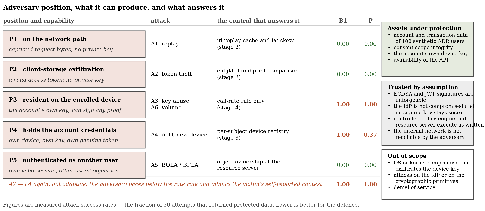

**Figure 2.** Threat model. Five adversary positions with the capability each confers, the attack that exercises it, the control that answers it, and the measured success rate under the FAPI 2.0 baseline (B1) and under continuous enforcement (P). The final row is the same position as P4 played adaptively (§9.3). Right: assets, trust assumptions and explicit scope exclusions.

### 5.3 Trust assumptions

We assume ECDSA and JWT signatures are unforgeable; that the identity provider is not compromised and its signing key remains secret; that the controller, the policy engine and the resource server execute as written; and that the internal service network is not reachable by the adversary. The resource server accepts requests only from the controller, identified by an internal service header on a private Docker network — this models network isolation and is explicitly weaker than the mutual TLS a production deployment would use (§12).

### 5.4 Security objectives

- **O1 (sender-constraining).** Possession of an access token alone never suffices; a valid proof of possession bound to the token's confirmation claim is required on every request.
- **O2 (replay resistance).** A captured request cannot be successfully replayed.
- **O3 (device continuity).** A request presenting a key the subject has never used is distinguishable from one presenting an enrolled key, on evidence the adversary cannot suppress.
- **O4 (behavioural response).** Anomalous behaviour within an otherwise valid session raises the controller's assessed risk and can change the decision.
- **O5 (object-level authorization).** A subject reaches only objects it owns.
- **O6 (bounded friction).** Legitimate traffic, including traffic whose context changes, is not systematically refused.

O1, O2 and O5 are properties of the baseline and the resource server. O3, O4 and O6 are the properties the continuous layer exists to provide, and §9 reports that O3 is achieved as evidence but not as a decision at the shipped operating point, O4 is not achieved for the device-resident regime at any operating point, and O6 is not achieved at all.

### 5.5 Out of scope

Operating-system or kernel-level compromise that exfiltrates the device private key to an arbitrary remote host is out of scope; we do not claim to defend a fully compromised client platform, though behavioural detection may partially mitigate it. Attacks against the identity provider itself, against the cryptographic primitives, and denial-of-service attacks are out of scope. Attacks on the authorization endpoint — including those addressed by PAR and PKCE — are out of scope of the *measurement*, because the measured data path begins at the resource API (§8.2, §12).

---

## 6. System under measurement

We evaluate three configurations of one codebase, selected by environment flags rather than by separate implementations, so that a measured difference is attributable to the enforcement layer rather than to implementation variance. Figure 1 shows the architecture; Figure 3 shows the per-request decision path.

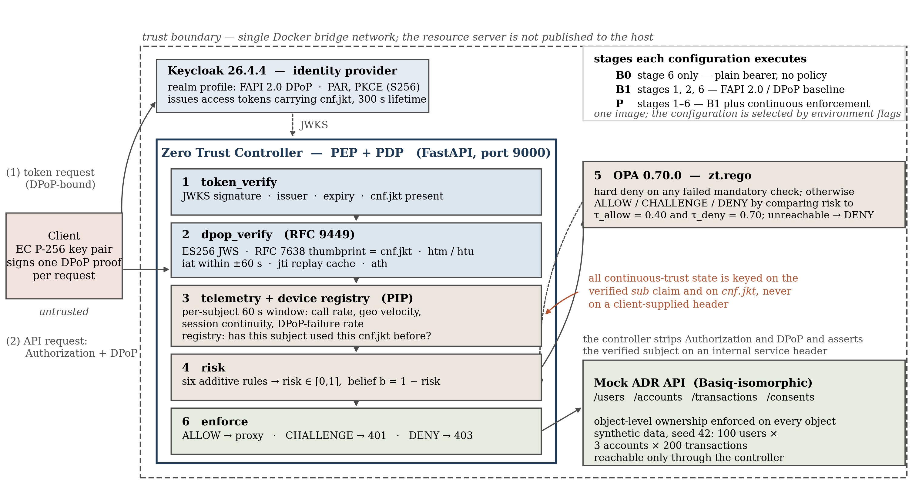

**Figure 1.** System architecture. Every component shown is a running container or a module in the released implementation, and every edge is a call the code makes. The six numbered stages are the controller's per-request pipeline; the inset states which stages each configuration executes. All continuous-trust state is keyed on the verified `sub` claim and on `cnf.jkt`, never on a client-supplied header (§6.4).

### 6.1 B0 — weak baseline

Plain OAuth 2.0 bearer tokens [20], no sender-constraining, no contextual policy; the controller forwards to the resource server after extracting the subject. B0 exists only to quantify how much of the total benefit is already delivered by the standard, and no claim in this paper is stated as a difference against B0 alone.

### 6.2 B1 — FAPI 2.0-correct baseline

The identity provider is Keycloak 26.4.4 with a realm configured to the FAPI 2.0 DPoP client profile: PAR, PKCE with S256, DPoP-bound access tokens carrying `cnf.jkt`, and a 300-second access-token lifetime. On every request the controller verifies the access token (JWKS signature against the realm's keys, issuer, expiry, presence of `cnf.jkt`) and then the DPoP proof: ES256 JWS verification against the JWK embedded in the proof header, rejection of any proof carrying private key material, recomputation of the RFC 7638 thumbprint and comparison against `cnf.jkt`, `htm` and `htu` against the request, `iat` within ±60 s, `jti` against a 120-second TTL replay cache, and `ath` against the presented access token. Approved requests are proxied. There is no telemetry, risk scoring or adaptive policy.

### 6.3 P — continuous enforcement

P is B1 plus, on every request: telemetry collection, a per-subject enrolled-device registry, deterministic rule-based risk scoring producing a risk value in [0, 1] (with belief `b = 1 − risk`), and an adaptive decision evaluated by an out-of-process policy engine — `ALLOW` if `risk < τ_allow`, `CHALLENGE` if `τ_allow ≤ risk < τ_deny`, `DENY` if `risk ≥ τ_deny`, with the shipped operating point `τ_allow = 0.40`, `τ_deny = 0.70`. Risk scoring is rule-based rather than learned, so that every decision is auditable and deterministic and so that the ablation in §9.7 can attribute an observed change to a named rule. Figure 4(a) lists the rules with their penalties and components; penalties are additive and capped at 1.0.

| Rule | Condition | Penalty | Component |
|---|---|---|---|
| R1 | presented key's thumbprint ≠ the token's `cnf.jkt` | 0.80 | device binding |
| R2 | subject is presenting a device key or fingerprint it has not used before | 0.35 | device binding |
| R3 | implied geographic velocity above 500 km/h | 0.60 | context |
| R5 | session continuity below 0.50 | 0.20 | context |
| R6 | DPoP-failure rate above 0.10 | 0.20 | context |
| R4 | call rate above 30 requests/minute | 0.25 | velocity |

The policy engine additionally applies hard denials independent of the risk value: a replayed `jti`, an invalid token, an invalid proof, or an unverified key binding all deny regardless of the score. Where an ablation removes a controller-side check, the corresponding hard denial is removed from the policy as well; otherwise the ablation would be a no-op because the policy would deny on the same condition.

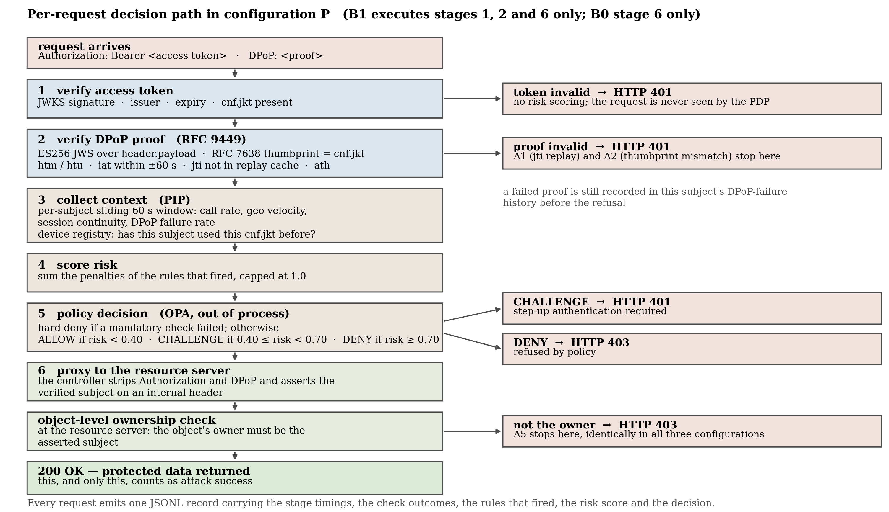

**Figure 3.** Per-request decision path in configuration P, with every refusal branch and the HTTP status it returns. B1 executes stages 1, 2 and 6 only; B0 stage 6 only. Attack success is defined at the bottom of the path: the resource server returning protected data.

### 6.4 Keying of continuous-trust state

Every piece of state the controller accumulates about a subject — the sliding 60-second request window, last-seen geography, session continuity, DPoP-failure history, and the set of device keys the subject has used — is keyed on the `sub` claim of the access token verified in stage 1, and device identity is taken from the token's `cnf.jkt`. Neither value is client-choosable.

This is not an implementation detail. Under the §5.2 assumption that the adversary controls every value they send, keying continuous-trust state on a self-reported device header gives every adversary an empty history by construction, and no behavioural rule can fire against an adversary who simply invents a device identifier. The same reasoning fixes the enrolment policy: the first key observed for a subject establishes the baseline, and later unknown keys are reported without being automatically enrolled, because auto-enrolling would make the adversary's key "known" after a single request and only the first request of a new-device attack would ever score as anomalous. We record this because it is the difference between a contextual layer that can be evaded for free and one that cannot, and because getting it wrong produces no error, no failing test and no anomalous metric.

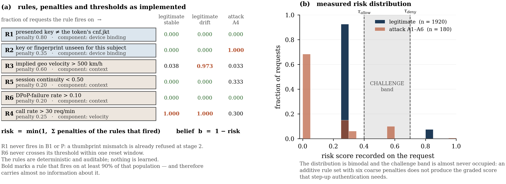

**Figure 4.** The risk mechanism. (a) The rule set as implemented, with each rule's penalty, the enforcement component it belongs to, and the fraction of each measured population it fires on. Bold marks a rule firing on at least 90% of a population — and therefore carrying almost no information about it. (b) The measured risk distribution. It is bimodal and the challenge band is almost never occupied, which is why the system is nominally adaptive and empirically binary (§9.4).

### 6.5 Resource server

A synthetic Basiq-isomorphic Accredited Data Recipient API exposes `/users`, `/accounts`, `/transactions` and `/consents`. It enforces object-level ownership on every object access, so BOLA and BFLA are testable independently of the enforcement layer. Its data is generated deterministically from a fixed seed: 100 users, 3 accounts each, 200 transactions per account, with no personal or financial information of any kind.

### 6.6 Enforcement invariant

Across B1 and P, possession of an access token alone is never sufficient: a valid DPoP proof bound to the token's `cnf.jkt` is required. P additionally requires the request to pass contextual risk evaluation. The attacks in §8 probe exactly this invariant.

---

## 7. Implementation

The testbed is four containerized services on a single private bridge network, brought up by one command.

**Identity provider.** Keycloak 26.4.4, two realms imported at startup. `openbanking-fapi2` carries the FAPI 2.0 DPoP client policy profile and a confidential client with DPoP-bound access tokens and a 300-second lifetime; `openbanking-b0` carries a public client with no sender-constraining, used only for B0. A hardcoded-claim protocol mapper pins the `sub` claim of issued tokens to the identifier of synthetic resource-server user 0, so that the identity the identity provider authenticates and the identity the resource server owns objects for are the same principal. The issuer hostname is fixed so that tokens obtained from the host and tokens verified inside the network carry the same `iss`.

**Zero Trust controller.** A FastAPI reverse proxy (Python 3.12) implementing the six-stage pipeline of Figure 3 as separate modules: `token_verify`, `dpop_verify`, `telemetry`, `device_registry`, `risk`, `policy_client`, `proxy`. Thumbprints follow RFC 7638; ES256 verification uses the `cryptography` library directly against the JWK embedded in the proof; the `jti` replay cache is an in-memory TTL cache sized at 100 000 entries. Each stage is timed with a monotonic clock and every request emits one JSON record carrying the stage timings, the check outcomes, the telemetry values, the rules that fired, the risk score, the decision and — for attack traffic — a ground-truth label that no enforcement decision reads (§8.4).

**Policy engine.** Open Policy Agent 0.70.0 evaluating `zt.rego` over a document containing the risk value, the telemetry, the check outcomes, the active feature flags and the thresholds. The controller fails closed: if the policy engine is unreachable, the decision is `DENY`.

**Client and attack harness.** A device simulator generates a P-256 key pair, computes its own thumbprint and signs a fresh DPoP proof per request. Legitimate load is generated by Locust; attacks are separate Python modules driven by a runner (§8).

**Harness control plane.** The controller exposes an administrative endpoint, guarded by an internal secret that never leaves the private network, which drops the telemetry history, the per-subject device registry and the `jti` cache. The attack runner calls it before each attack so that, for example, the volume-abuse attack's rate signal does not inherit the device-resident attack's burst. It is never exercised by attack or workload traffic and is not part of the measured data path.

**Deviations from the specifications, stated explicitly.** The controller compares `htu` against the full request URI including the query string, whereas RFC 9449 specifies that `htu` excludes query and fragment; this is stricter than the specification rather than weaker, and the client constructs `htu` the same way, so it does not affect any measured outcome, but an implementation following the RFC exactly would differ. The controller does not implement DPoP nonces. mTLS-based sender-constraining is configured nowhere and is not evaluated. The measured data path exercises token verification and proof verification but not the authorization endpoint, so PAR and PKCE are configured in the realm and not on the measured path (§8.2, §12).

---

## 8. Experimental methodology

### 8.1 Design

Each experiment follows the same structure: research question, hypothesis, configurations compared, controlled variables, metric, and interval or effect-size estimate. Figure 5 shows the workloads, the configuration cells and the outputs.

| ID | Question | Hypothesis | Cells compared | Primary metric |
|---|---|---|---|---|
| E1 | RQ1 | B1 eliminates the token-possession attacks; P changes the outcome of the attacks B1 cannot stop | B0, B1, P × A1–A6 | attack success rate, 30 attempts/cell |
| E2 | RQ2 | Any benefit P shows in E1 persists when the adversary adapts within the threat model | B1, P, P at the recalibrated threshold × A7 | attack success rate, 30 attempts/cell |
| E3 | RQ3 | Continuous enforcement imposes friction on legitimate traffic, concentrated on context change | B0, B1, P × legitimate workload | challenge and deny rate by context profile |
| E4 | RQ3 | The added per-request cost is dominated by policy and telemetry, not cryptography | B0, B1, P × legitimate workload | total and per-stage latency; controller CPU and memory |
| E5 | RQ3 | The added cost is a fixed per-request tax rather than a super-linear degradation | B0, B1, P × 5/10/20/40 clients | latency percentiles and achieved rate |
| E6 | RQ4 | Benefit and cost are attributable to identifiable components | P, P−device-binding, P−context, P−velocity, B1 | attack success and friction per cell |
| E7 | RQ4 | Where the defence fails, the operating point and the signal are distinguishable causes | P, decisions recomputed over τ ∈ [0.05, 1.00] | attack and legitimate refusal rate vs τ |
| E8 | integrity | The enforcement path converts a correct verdict into a block | B1, P with a perfect-detector oracle | attack success rate |

Configurations and ablation cells are selected by environment flags on one controller image. The identity provider and resource server are held constant. Each cell records its active flag set in every record it produces, and carries a distinct run label so that cells sharing a mode remain separable in analysis.

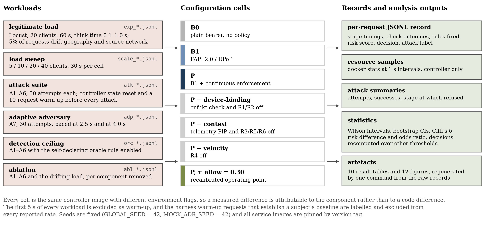

**Figure 5.** Experimental setup and measurement pipeline. Every configuration cell is the same controller image with different environment flags, so a measured difference is attributable to the component rather than to a code difference.

### 8.2 Attack suite

Seven attacks, each implemented against the running system. **Success is defined as the resource server returning protected data (HTTP 200)**, not as the controller reaching a particular decision — a controller that allows a request the resource server then refuses has not defended anything, and a controller that challenges is counted as having refused. Each attack runs 30 attempts per cell.

- **A1, network replay (P1).** Capture a valid request and resend it verbatim. Because a captured request is by definition one the victim already sent, the harness issues the original once — uncounted — before replaying, so that every counted attempt is a true replay rather than the victim's own first call.
- **A2, token theft without the key (P2).** Present a stolen access token from a fresh context, signing the proof with a newly generated key that does not match `cnf.jkt`.
- **A3, device-resident key abuse (P3).** Operate on the enrolled device with cryptographically valid proofs, driving a burst with no inter-request delay across a mix of the victim's own endpoints. The endpoints are the victim's real objects, read back during warm-up: driving traffic at a non-existent object would make the resource server answer 404, which the scoring would record as a refusal that no defence produced.
- **A4, account takeover from a new device (P4).** The adversary runs the token flow themselves, so the identity provider issues them a genuine access token whose `cnf.jkt` is their own key's thumbprint, and every DPoP proof they sign matches it. They report their own device identifier, fingerprint and geography. Nothing at the FAPI 2.0 layer is out of place.
- **A5, BOLA/BFLA (P5).** Authenticated access to an account object and its transaction collection belonging to a different synthetic user. The victim object identifier is derived from the documented generator seed rather than discovered through the API, so that a refusal is an ownership decision and not a 404.
- **A6, volume abuse (P3).** Abnormal request volume from a valid session on the enrolled key, with no other anomaly.
- **A7, paced account takeover (P4, adaptive).** A4 played by an adversary who reads the defence's own threat model: they pace their requests below any absolute rate threshold and copy the victim client's self-reported session identifier, geography, source network and fingerprint. Both capabilities are entailed by §5.2. What remains is the one signal they cannot forge — a `cnf.jkt` the subject has never used. A7 therefore measures whether that signal is actionable on its own. It is reported separately from the primary taxonomy, writes to its own output directory under its own run labels, and is not part of the default suite, so adding it cannot perturb any primary number.

**Per-attack isolation.** Before each attack the controller's continuous-trust state is reset and a short legitimate warm-up — 10 requests from the victim's enrolled device — re-establishes the subject's baseline. Both halves are necessary. Without the reset, the volume attack's rate signal inherits the device-resident attack's burst and the takeover attack's device signal inherits the token-theft attack's foreign key, and no per-attack number is interpretable. Without the warm-up there is no baseline for a new device or a new geography to be inconsistent with, and a new-device adversary is indistinguishable from a first-time legitimate user. Warm-up requests are labelled and excluded from every reported rate.

### 8.3 Legitimate workload

Locust drives 20 concurrent clients for 60 seconds against each configuration, with think time drawn uniformly from 0.1–1.0 s and a task mix of 5:3:1 over account listing, transaction listing and profile retrieval. Each request is labelled `stable` or `drift`; with probability 0.05 a request is `drift` and carries a changed region and source network, simulating travel or a mobile handover. The controller records the label, which is what makes the split in §9.4 computable after the fact.

All simulated clients share one subject and one enrolled device. This is a deliberate consequence of the realm providing a single test identity together with the design decision of §6.4: giving each virtual client its own freshly generated key pair would model one account presenting twenty unknown device keys at once, every request would trip the new-device rule, and the "legitimate traffic" baseline would not be legitimate. The consequence for the results is material and we return to it in §9.5 and §12.

### 8.4 Measurement integrity

A testbed in which the attack harness and the defence share a process can trivially leak ground truth from one to the other, and the leak is not visible in the results — it looks like detection. We hold the suite to one rule: **no enforcement decision may read a value that exists only because the harness knows the request is an attack.**

The risk engine contains a rule, disabled by default and reachable only through an explicit switch, that scores any request carrying a self-declared attack header at 0.90 — nearly the deny threshold on its own. In an earlier version of this testbed four of the six attacks set that header on every request, and P's apparent blocking of them was, in large part, the attack simulator telling the risk engine that it was an attack. The tell was the one attack that deliberately did not set it, which succeeded on 100% of attempts while the self-tagging attacks were fully blocked. In every number reported here the header is never sent and the rule never fires; `table7_risk_components.csv` reports the rule's firing rate in every population and reads 0.000 throughout, including in the adaptive cells. The rule is retained solely to measure a **detection ceiling** — what the enforcement pipeline would block *given a perfect detector* — which is a genuinely useful quantity as long as it is never confused with detection (§9.8).

Three further defects in earlier versions of this testbed would each have inflated the defence's apparent performance, and we name them because a reader cannot detect them from a results table. A4 originally replayed the *victim's* token while signing with a different key — a thumbprint mismatch, and therefore a second copy of A2 — which made B1 appear to stop the very attack that exists because B1 cannot; correcting it changes B1's A4 success rate from 0.000 to 1.000, the value the design predicts. A5 targeted an object identifier no synthetic account carried, so every attempt returned "not found" and was scored as blocked without an ownership check ever running. A3 drove half its traffic at a non-existent account for the same reason. All three are corrected here.

### 8.5 Statistics

Proportions — attack success, challenge and deny rates — are reported with Wilson 95% score intervals [23]. Latency is reported as median, p95 and p99, with a percentile-bootstrap 95% interval on the mean (2 000 resamples, fixed seed). Differences between configurations are reported as effect sizes rather than p-values alone: Cliff's δ [24] for latency distributions, computed through the Mann–Whitney U identity and checked against the pairwise definition in the released unit tests; and risk difference with a 95% interval plus a Haldane–Anscombe-corrected odds ratio for attack-success proportions, which stays finite when a cell is 0/30 or 30/30, as several are. We do not apply significance tests where the comparison is deterministic — the threshold sweep of §9.6 recomputes decisions over recorded scores and has no sampling error to test.

**What the intervals do and do not cover.** Each attack cell is 30 attempts; each performance cell is a single 60-second run at 20 clients (about 1 900 requests after warm-up exclusion); each scaling cell is a single 30-second run. The intervals therefore describe sampling variation *within* a run, not variation *between* independent runs of the same cell, which we did not measure. This is a real limitation and we state it as one (§12) rather than let the interval width imply more than it covers.

### 8.6 Warm-up

Every workload begins against a freshly restarted controller, and the first 5 seconds of every run is excluded. This is not cosmetic: before the exclusion the lowest-concurrency scaling cell reports a 53 ms median against approximately 11 ms after, which would have made the least-loaded cell appear the slowest.

### 8.7 Environment

A single documented host: Apple M5, 10 cores, 16 GiB RAM, macOS 26.6.2 (build 25G83); Docker Engine 29.4.1 with Compose 5.1.3. Images: `quay.io/keycloak/keycloak:26.4.4`, `openpolicyagent/opa:0.70.0-debug`; the controller and resource server are built from the repository on `python:3.12-slim` with FastAPI 0.115.0, uvicorn 0.30.6, httpx 0.27.2, cryptography 43.0.1, python-jose 3.3.0 and cachetools 5.5.0. The load generator (Locust 2.31.3) runs on the host over loopback to the controller's published port; all inter-service traffic is on one Docker bridge network. Analysis runs on Python 3.12.13 with numpy 2.1.2, scipy 1.14.1, pandas 2.2.3 and matplotlib 3.9.2. Random seeds are fixed throughout (`GLOBAL_SEED = 42`, `MOCK_ADR_SEED = 42`).

The host is a laptop under Docker Desktop rather than a dedicated benchmarking machine. We therefore report distributions and effect sizes rather than single figures, and we flag single-cell tail outliers rather than interpreting them.

---

## 9. Results

Every number below is produced by the released pipeline and traces to a named file under `data/tables/`, cited at first use. Figures are in `paper/figures/`.

### 9.1 What the baseline already does, and what it does not (RQ1)

**Table 2 — attack success rate by configuration.** Wilson 95% intervals, 30 attempts per cell. Source: `table1_taxonomy.csv`; plotted in Figure 6(a).

| Attack | Adversary | B0 | B1 | P | Stopped by B1? | Does P change it? |
|---|---|---|---|---|---|---|
| A1 network replay | P1 | 1.000 [0.886, 1.000] | 0.000 [0.000, 0.114] | 0.000 [0.000, 0.114] | yes | no |
| A2 token theft without key | P2 | 1.000 [0.886, 1.000] | 0.000 [0.000, 0.114] | 0.000 [0.000, 0.114] | yes | no |
| A3 device-resident key abuse | P3 | 1.000 [0.886, 1.000] | 1.000 [0.886, 1.000] | **1.000 [0.886, 1.000]** | no | **no** |
| A4 ATO from a new device | P4 | 1.000 [0.886, 1.000] | 1.000 [0.886, 1.000] | **0.367 [0.219, 0.545]** | no | **yes** |
| A5 BOLA / BFLA | P5 | 0.000 [0.000, 0.114] | 0.000 [0.000, 0.114] | 0.000 [0.000, 0.114] | n/a | no |
| A6 volume abuse | P3 | 1.000 [0.886, 1.000] | 1.000 [0.886, 1.000] | **1.000 [0.886, 1.000]** | no | **no** |

**Effect sizes** (`table_effect_sizes.csv`). B1 versus B0: risk difference −1.000 (95% CI [−1.000, −1.000], odds ratio 0.0003) for both A1 and A2; −0.333 ([−0.424, −0.242], OR 0.203) pooled across A1–A6. P versus B1: −0.633 ([−0.806, −0.461], OR 0.0097) for A4; exactly 0.000 for every other attack; −0.106 ([−0.208, −0.003], OR 0.653) pooled.

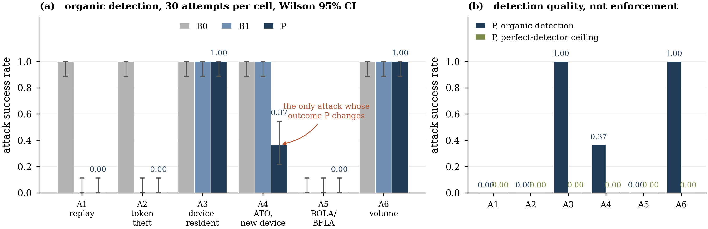

**Figure 6.** (a) Attack success rate by configuration, 30 attempts per cell, Wilson 95% intervals. P changes the outcome of exactly one attack. (b) The same organic result against the perfect-detector ceiling: given a correct verdict the enforcement path blocks every attack, so the whole organic gap is detector quality rather than architecture (§9.8).

**Sender-constraining alone eliminates the token-possession adversaries.** A1 and A2 go from certain success to zero. The `jti` replay cache refuses A1 and the thumbprint comparison refuses A2, both at proof verification, so neither attack ever reaches the risk engine — which is why both read 0.000 on every rule in `table7_risk_components.csv`. Continuous enforcement adds nothing here, exactly as designed. A deployment that is already FAPI 2.0-correct should not expect a contextual layer to help against these adversaries, and a proposal that demonstrates a Zero Trust layer defeating replay or stolen-token reuse is demonstrating something the baseline already does.

**The baseline is defenceless against the other three, and continuous enforcement changes one of them.** A3, A4 and A6 all succeed on 30 of 30 attempts under B1, as the threat model predicts: in A3 and A6 the adversary holds the account's own key, and in A4 the adversary's token is genuinely bound to the adversary's own key. Under P, A3 and A6 are unchanged at 30/30 and A4 falls to 11/30.

**A5 does not discriminate between configurations and should not be read as evidence for any of them.** It is refused in all three, including B0, because object-level ownership is enforced at the resource server and not by the enforcement layer under test. We report it for completeness of the taxonomy, and note that a system whose BOLA defence lives entirely downstream of the enforcement layer gets no credit for that defence. The variant that *would* exercise the enforcement layer is a consent-scope violation evaluated at the policy decision point — a request within the subject's own objects but outside the scope its consent covers — which this testbed models in its data but does not check in its policy, and which we identify as the more informative attack to implement (§12).

**A3 is the attack the contextual layer exists for, and the contextual layer does not touch it.** `table7_risk_components.csv` shows why: the only rule that fires across A3's requests is the call-rate rule, on 30.0% of them, contributing 0.25 against a challenge threshold of 0.40. A request that trips the velocity rule and nothing else is allowed. A6 fails for exactly the same reason and records exactly the same mean risk of 0.075 — the same value as A5, an attack that has nothing to do with volume.

### 9.2 The one benefit, read per request (RQ1)

The aggregate 11/30 conceals its own mechanism. Figure 11(a) plots A4 request by request with the rules that fired beneath it, reconstructed from the controller's own records.

The structure is exact. Request 1 scores 1.000 — the unknown-device penalty, the geo-velocity penalty and the session-continuity penalty together, capped — and is denied. Requests 2 through 10 score 0.55, the unknown-device penalty plus session continuity, and are challenged. **Requests 11 through 21 score 0.35, the unknown-device penalty alone, and are allowed: these eleven requests are the 11 successes.** Requests 22 through 30 score 0.60, the unknown-device penalty plus the call rate, and are challenged.

Both flanking signals are artefacts of sliding-window bookkeeping rather than properties of the adversary:

- **Session continuity self-extinguishes.** It measures the fraction of recent events in the window carrying the current session identifier. After the 10-request warm-up the adversary's first request scores 0.0, but each of the adversary's own subsequent requests raises it, and it crosses 0.50 at the adversary's eleventh request. The adversary's own traffic dilutes the baseline it is being compared against.
- **The call rate engages late.** It counts events in a 60-second window shared with the warm-up. It crosses 30 only once the warm-up's 10 events plus the adversary's own requests exceed 30 — that is, at the adversary's twenty-first request.

Between the two, the only rule firing is the one that reflects unforgeable evidence: the subject is presenting a key it has never used. That rule is priced at 0.35, and `τ_allow` is 0.40. **The single signal the adversary cannot suppress cannot, on its own, change any decision.** The 11 successes are not noise or a tuning imprecision; they are the exact width of the interval in which the defence is relying on evidence it has priced below its own threshold.

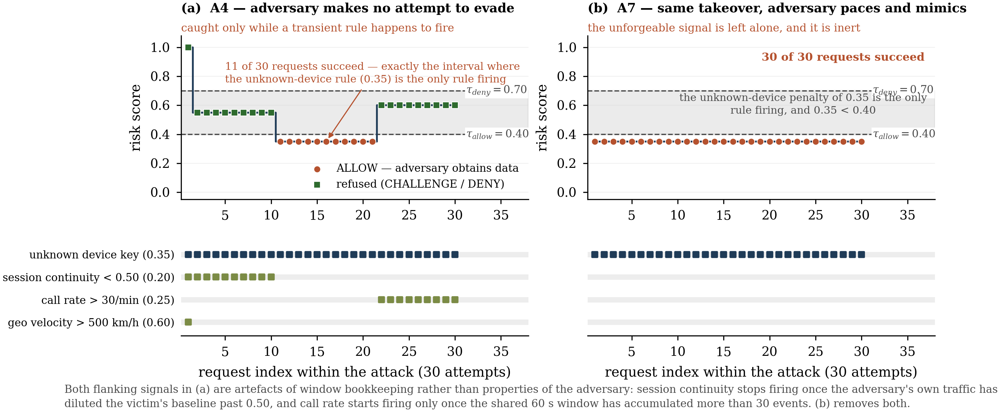

**Figure 11.** Account takeover, per request, with the rules that fired beneath each panel. (a) A4: the adversary is refused only while one of two transient signals happens to fire, and the eleven requests that succeed are exactly the interval in which the unknown-device penalty of 0.35 is the only rule firing — below the 0.40 threshold. (b) A7: the same takeover by an adversary who paces and mimics, leaving only the unforgeable signal, which is inert. Thirty of thirty succeed.

### 9.3 The benefit does not survive an adaptive adversary (RQ2)

§9.2 makes a prediction: an adversary who removes both transients keeps the risk at 0.35 on every request and succeeds on all of them. A7 tests it. The adversary paces their requests and copies the victim client's self-reported session identifier, geography, source network and fingerprint — both capabilities granted by §5.2, neither requiring anything new.

**Table 3 — the adaptive adversary.** 30 attempts per cell. Source: `table9_adaptive_adversary.csv`; plotted in Figure 10(b) and Figure 11(b).

| Cell | Configuration | Pace | A7 success | Mean risk | Decisions |
|---|---|---|---|---|---|
| B1-adaptive | FAPI 2.0 baseline | 2.5 s | 1.000 [0.886, 1.000] | — | 30 allow |
| P-adaptive | P, τ_allow = 0.40 (shipped) | 2.5 s | 0.900 [0.744, 0.965] | 0.375 | 27 allow, 3 challenge |
| P-adaptive-slow | P, τ_allow = 0.40 (shipped) | 4.0 s | **1.000 [0.886, 1.000]** | 0.350 | 30 allow |
| P-adaptive-tau030 | P, τ_allow = 0.30 | 2.5 s | **0.000 [0.000, 0.114]** | 0.375 | 30 challenge |
| P-adaptive-slow-tau030 | P, τ_allow = 0.30 | 4.0 s | **0.000 [0.000, 0.114]** | 0.350 | 30 challenge |

At a 2.5-second pace the adversary succeeds 27 times in 30. The three refusals are the residual rate transient and nothing else: the sliding window is shared with the 10 warm-up requests, so a pace just under the threshold still crosses it briefly, and the call-rate rule fires on exactly 10% of the adaptive adversary's requests. At a 4.0-second pace it does not fire at all, every request scores 0.350 from the unknown-device rule alone, and **the adaptive adversary succeeds on all 30 attempts — the same outcome as the FAPI 2.0 baseline that has no contextual layer at all.**

This is the paper's central negative result, and it is stronger than "the system missed an attack". The system *collected* the right evidence on every one of those 30 requests: the device registry reported an unknown key 30 times out of 30, correctly and unforgeably, and the record shows it. What failed is the conversion of that evidence into a decision. A defence that observes the adversary on every request and allows every request has not detected anything in any sense a deployer cares about.

It also reframes §9.1's positive result. P's reduction of A4 from 30/30 to 11/30 is real as a measurement and is not evidence of a security property: it measures the defence's behaviour against an adversary who does not adapt, and the adaptation required to erase it is to send requests more slowly and to copy headers.

### 9.4 The cost on legitimate traffic (RQ3)

**Table 4 — challenge and deny rates on legitimate traffic.** 20 clients, 60 s per configuration, warm-up excluded. Source: `table2_false_challenge.csv`; decomposed in Figure 12.

| Config | Context | n | Challenge rate | Deny rate | Total friction |
|---|---|---|---|---|---|
| B0 | stable | 1865 | 0.000 [0.000, 0.002] | 0.000 [0.000, 0.002] | 0.000 [0.000, 0.002] |
| B0 | drift | 73 | 0.000 [0.000, 0.050] | 0.000 [0.000, 0.050] | 0.000 [0.000, 0.050] |
| B1 | stable | 1838 | 0.000 [0.000, 0.002] | 0.000 [0.000, 0.002] | 0.000 [0.000, 0.002] |
| B1 | drift | 74 | 0.000 [0.000, 0.049] | 0.000 [0.000, 0.049] | 0.000 [0.000, 0.049] |
| P | stable | 1846 | 0.000 [0.000, 0.002] | **0.0385 [0.031, 0.048]** | 0.0385 [0.031, 0.048] |
| P | drift | 74 | 0.000 [0.000, 0.049] | **0.973 [0.907, 0.993]** | 0.973 [0.907, 0.993] |
| P | all | 1920 | 0.000 [0.000, 0.002] | **0.0745 [0.064, 0.087]** | 0.0745 [0.064, 0.087] |

B0 and B1 impose no friction by construction: neither evaluates contextual risk, so neither can refuse a request that passes its credential checks. Three features of P's column deserve comment, and none is flattering.

**Essentially every request whose context drifts is refused outright: 72 of 74.** The geo-velocity rule synthesizes a 1 000 km displacement for any change of region and divides by the elapsed interval. At request rates measured in milliseconds, *any* region change implies an impossible velocity. At this cadence the rule is not a velocity test; it is a "region changed" trip-wire.

**The friction is roughly double the drift rate, and the stable-context figure is not an independent false-positive rate.** The workload's 5% drift probability produced 74 drift-labelled requests among 1 920 (3.9%), and total friction was 7.4%: 72 refusals among drift-labelled requests and a near-identical 71 among stable-labelled ones. A per-request geo-velocity rule refuses the return leg exactly as readily as the departure, so each excursion costs two refusals — the request that moves the context and the next request that moves it back. Figure 12(a) shows this directly. Reporting 3.85% as a false-positive rate on stable traffic would be a misreading: it is the shadow of the drift rate.

**The adaptive `CHALLENGE` band is never used.** P issued 143 refusals and zero challenges. Every one of the 143 carries the same pair of rules — geo velocity and call rate — for a risk of 0.85 (Figure 12(b)). The measured risk distribution on legitimate traffic is bimodal, at 0.25 when only the call-rate rule fires and 0.85 when geo velocity joins it (Figure 4(b)), and it steps straight over the [0.40, 0.70) window. Step-up authentication is the mechanism that is supposed to make contextual enforcement tolerable for legitimate users, and on this workload it never fires. The system is nominally adaptive and empirically binary.

The cause of the third observation is worth isolating, because it is not the geo rule alone. In the first seconds of the run, before the rate window fills, eight requests scored 0.60 from geo velocity by itself and were *challenged* — the only challenges the system ever issued. Once the call-rate rule saturates, the same geo event scores 0.85 and is denied. **A rule that fires on 100% of legitimate traffic and therefore carries no information about it nevertheless changes outcomes, by carrying every other rule's contribution across the deny threshold.** An uninformative rule in an additive scheme is not harmless.

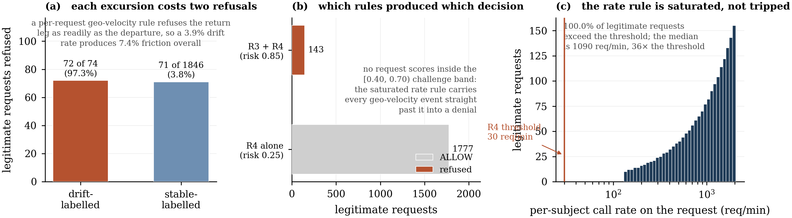

**Figure 12.** Anatomy of the friction on legitimate traffic. (a) Each context excursion costs two refusals, because a per-request velocity rule refuses the return leg as readily as the departure. (b) Every one of the 143 refusals carries the same rule pair, and no request lands in the challenge band. (c) The call-rate rule fires on 100% of legitimate requests at a median of 36 times its own threshold: it carries no information, and still pushes every geo-velocity event past the deny line.

### 9.5 Which rules fired, and on what (RQ3, RQ4)

**Table 5 — rule firing rate by population, configuration P.** Source: `table7_risk_components.csv`; also shown against each rule in Figure 4(a).

| Population | n | R2 unknown device | R3 geo velocity | R4 call rate | R5 session continuity | oracle rule | mean risk |
|---|---|---|---|---|---|---|---|
| Attack A1 | 30 | 0.000 | 0.000 | 0.000 | 0.000 | **0.000** | 0.000 |
| Attack A2 | 30 | 0.000 | 0.000 | 0.000 | 0.000 | **0.000** | 0.000 |
| Attack A3 | 30 | 0.000 | 0.000 | 0.300 | 0.000 | **0.000** | 0.075 |
| Attack A4 | 30 | **1.000** | 0.033 | 0.300 | **0.333** | **0.000** | **0.507** |
| Attack A5 | 30 | 0.000 | 0.000 | 0.300 | 0.000 | **0.000** | 0.075 |
| Attack A6 | 30 | 0.000 | 0.000 | 0.300 | 0.000 | **0.000** | 0.075 |
| Legitimate, stable | 1846 | 0.000 | 0.0385 | **1.000** | 0.000 | **0.000** | 0.273 |
| Legitimate, drift | 74 | 0.000 | **0.973** | **1.000** | 0.000 | **0.000** | 0.834 |

R1 and R6 never fire and are omitted: R1 is pre-empted by the binding check at proof verification, and R6's DPoP-failure history never crosses its threshold within a reset window. A1 and A2 read zero everywhere because they are refused before risk scoring. The oracle column is the standing audit of §8.4 and reads 0.000 throughout.

**The most consequential row is the legitimate-stable one.** The call-rate rule fires on **100%** of legitimate requests. It is not marginally exceeded: the median per-subject call rate observed on a legitimate request is 1 090 requests/minute, 36 times the rule's own 30 req/min threshold (Figure 12(c)). Twenty concurrent clients of one subject saturate an absolute per-subject rate threshold comprehensively. The rule that is supposed to catch volume abuse therefore carries no discriminating information whatever, which is why A3, A5 and A6 all record an identical mean risk of 0.075 — a device-resident attacker, a volume attacker, and an attacker doing neither are indistinguishable to this rule set.

**The unknown-device rule is the only signal that behaves as intended.** It fires on 100% of A4's requests and on 0.000 of legitimate requests, in both context profiles. As a detector it is perfect on this workload. As a decision input at the shipped operating point it is inert, which is the subject of §9.6.

### 9.6 Operating point versus signal (RQ4)

Reporting a single operating point cannot distinguish "the contextual signal is absent" from "the signal is present but priced below the threshold". Because the risk score is recorded on every request, the decision each request would have received under a different `τ_allow` can be recomputed exactly, at no experimental cost and with no sampling error. Requests refused by a credential check are counted as blocked at every threshold, since no threshold changes them.

**Table 6 — decisions recomputed over the measured risk scores (selected rows).** Source: `table6_threshold_sensitivity.csv`; full curve in Figure 10(a).

| τ_allow | All attack requests refused | A3 refused | A4 refused | A6 refused | Legitimate stable refused | Legitimate drift refused |
|---|---|---|---|---|---|---|
| ≤ 0.25 | 0.650 | 0.300 | 1.000 | 0.300 | **1.000** | 1.000 |
| 0.30 | 0.500 | 0.000 | **1.000** | 0.000 | **0.0385** | 0.973 |
| **0.40 (shipped)** | 0.439 | 0.000 | 0.633 | 0.000 | 0.0385 | 0.973 |
| 0.60 | 0.389 | 0.000 | 0.333 | 0.000 | 0.0385 | 0.973 |
| 0.65 | 0.339 | 0.000 | 0.033 | 0.000 | 0.0385 | 0.973 |

**For account takeover the binding constraint is the operating point.** Moving `τ_allow` from 0.40 to 0.30 refuses 100% of A4's requests, up from 63.3%, at *identical* measured friction on legitimate traffic in both context profiles — because no legitimate request in this workload scores anywhere in [0.30, 0.40). The 0.35 unknown-device penalty falls just on the wrong side of the shipped threshold, and moving the threshold by 0.10 is free on this workload.

This is a claim about a recomputation, so we tested it against the running system rather than resting on the arithmetic. The τ_allow = 0.30 cells of Table 3 are live runs: the recalibrated operating point refuses the adaptive adversary on 30 of 30 attempts at both paces, which the shipped operating point does not do at either. The remedy is therefore validated against the adversary that broke the original result, not merely against the adversary that the original result was measured on.

**For device-resident and volume abuse the binding constraint is the signal.** A3 and A6 begin to be refused only at `τ_allow ≤ 0.25`, where the call-rate rule alone becomes actionable — and at that threshold the same rule refuses **100%** of legitimate traffic, stable and drifting alike. There is no threshold at which this rule set separates A3 or A6 from the legitimate workload, and Table 6 shows the two curves crossing nowhere. The failure is in the signal, not the operating point. An absolute per-subject call-rate threshold cannot distinguish an adversary driving a burst through a session from the account's own legitimate clients driving a burst through the same session, because per-subject request rate is not a property that separates them. Discriminating them needs a signal this rule set does not have: a per-device or per-client denominator rather than a per-subject one, a baseline-relative rather than absolute threshold, or an endpoint-mix or inter-arrival-regularity feature of the kind used offline in [6].

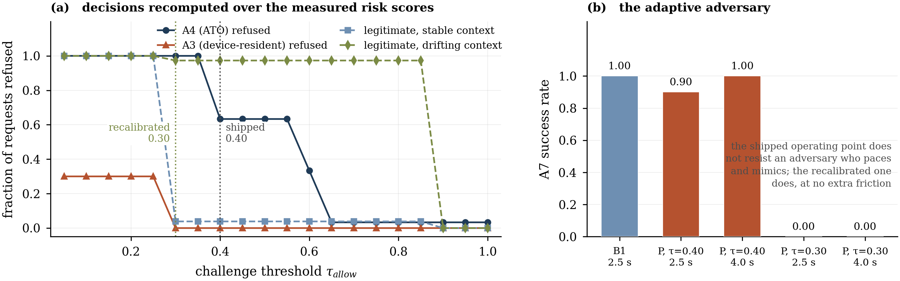

**Figure 10.** (a) Decisions recomputed over the risk scores P actually recorded. Moving the challenge threshold from 0.40 to 0.30 refuses 100% of A4 at identical legitimate friction; no threshold separates A3 from the legitimate workload. (b) Live runs of the adaptive adversary: the shipped operating point does not resist it at either pace, and the recalibrated one refuses it completely at both.

### 9.7 Component attribution (RQ4)

**Table 7 — attack success and legitimate-traffic friction per ablation cell.** Each cell runs the full attack suite (30 attempts × 6 attacks) and a 60-second drifting legitimate workload. Source: `table5_ablation.csv`; plotted in Figure 9.

| Cell | A1 | A2 | A3 | A4 | A5 | A6 | Pooled attack success | Friction, stable | Friction, drift |
|---|---|---|---|---|---|---|---|---|---|
| **P** | 0.000 | 0.000 | 1.000 | **0.367** | 0.000 | 1.000 | 0.394 [0.326, 0.467] | 0.039 | 0.973 |
| P − device-binding | 0.000 | 0.000 | 1.000 | **0.967** | 0.000 | 1.000 | 0.494 [0.422, 0.567] | 0.038 | 0.973 |
| P − context | 0.000 | 0.000 | 1.000 | **1.000** | 0.000 | 1.000 | 0.500 [0.428, 0.572] | **0.000** | **0.000** |
| P − velocity | 0.000 | 0.000 | 1.000 | **0.667** | 0.000 | 1.000 | 0.444 [0.374, 0.517] | 0.038 | 0.973 |
| B1 | 0.000 | 0.000 | 1.000 | 1.000 | 0.000 | 1.000 | 0.500 [0.428, 0.572] | 0.000 | 0.000 |

Cells are feature-flag settings on one codebase. *P − device-binding* disables the thumbprint binding check and rules R1/R2; *P − context* disables the telemetry PIP and with it R3, R5 and R6; *P − velocity* disables R4 alone and is a strict subset of *P − context*. Device binding is deliberately not part of "context": it is keyed on the token's `cnf.jkt` rather than on the PIP, which is what lets the two be ablated independently.

**No single component detects account takeover.** Removing device binding takes A4 from 0.367 to 0.967; removing context takes it to 1.000. With context intact but device binding gone the adversary still succeeds 29 times in 30; with device binding intact but context gone, 30 times in 30. Detection is the *additive conjunction* crossing a threshold — the 0.35 unknown-device penalty is inert alone and becomes actionable only when session continuity (0.20) or call rate (0.25) is added to it. This is exactly the mechanism §9.2 and §9.3 show to be fragile, viewed from the component side: removing the velocity rule alone, which fires on only 30% of A4's requests, still costs nearly half the measured gain (0.367 → 0.667).

**One component supplies the entire cost and almost none of the independent benefit.** Friction is identical across P, P − device-binding and P − velocity (3.8–3.9% stable, 97.3% drift) and falls to exactly zero in P − context. Every false refusal in this system comes from the contextual group, and specifically from geo velocity, which fires on 97.3% of drifting legitimate requests and 3.85% of stable ones against 3.3% of A4's requests. The component a deployer would most want to disable on usability grounds is the one whose removal costs the most measured security — but it earns that security by topping up another rule rather than by discriminating on its own.

**Device binding is free but, as shipped, inert.** Removing it raises A4 from 0.367 to 0.967, the largest single-component difference in the table, and it costs nothing measurable in friction, CPU or latency. The natural reading — adopt the per-subject device registry first — is right about the cost and wrong about the benefit unless the penalty is also re-priced above `τ_allow`. At 0.35 against a 0.40 threshold it contributes only by combining with rules that are themselves transient (§9.2) or uninformative (§9.5).

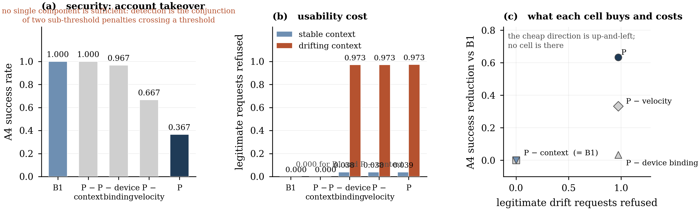

**Figure 9.** Ablation. (a) No single component reduces account takeover below 0.967; detection is a conjunction of sub-threshold penalties crossing a threshold. (b) The entire usability cost comes from the contextual group. (c) The two together: no cell occupies the cheap region of the trade-off plane.

### 9.8 Detection ceiling (integrity check)

Re-running the identical suite with a perfect-detector oracle enabled — every attack request declaring itself to the risk engine — takes P to 0.000 on all six attacks (`table1b_oracle_ceiling.csv`), while B1 is unchanged because it has no risk engine to inform. Figure 6(b) shows the two side by side.

Two readings follow. First, **the enforcement machinery downstream of detection is sound**: given a correct verdict, the PDP/PEP path converts it into a block on every request, with no leakage. The negative results in §9.1 and §9.3 are therefore not failures of the architecture's enforcement path. Second, and more useful to anyone building on this testbed, **the entire distance between P's organic result and blocking all six attacks is detector quality**, not enforcement. A testbed that leaks ground truth into the detector measures this ceiling while appearing to measure detection, and the two differ here by 4 of 6 attacks.

### 9.9 Per-request cost (RQ3)

**Table 8 — per-request latency by configuration.** Legitimate traffic, 20 clients, 60 s, warm-up excluded. Source: `table3_latency.csv`; distribution and stage breakdown in Figure 7.

| Config | n | p50 (ms) | p95 (ms) | p99 (ms) | mean (ms) [95% CI] |
|---|---|---|---|---|---|
| B0 | 1938 | 6.83 | 18.56 | 28.90 | 8.72 [8.50, 8.96] |
| B1 | 1912 | 7.42 | 19.86 | 30.35 | 9.47 [9.23, 9.75] |
| P | 1920 | 13.64 | 36.96 | 57.95 | 17.09 [16.57, 17.65] |

P versus B1: **+6.22 ms at the median, +17.10 ms at p95, +27.60 ms at p99**, mean +7.62 ms, Cliff's δ = 0.580 (large). B1 versus B0: +0.60 ms at the median, δ = 0.115 (negligible). **Sender-constraining is close to free; continuous enforcement is not.**

**Table 9 — mean per-stage latency (ms).** Same source.

| Config | token verify | DPoP verify | telemetry + registry | risk | policy (OPA) | proxy |
|---|---|---|---|---|---|---|
| B0 | — | — | — | — | — | 8.658 |
| B1 | 0.274 | 0.222 | 0.002 | — | — | 8.945 |
| P | 0.247 | 0.186 | 0.155 | 0.007 | **9.386** | 7.084 |

**The cost is not where design intuition puts it.** DPoP proof verification — an ES256 signature check, a thumbprint recomputation and comparison, an access-token hash and a replay-cache lookup — costs 0.19 ms, about 1% of P's mean request. The contextual layer's own work, telemetry collection plus rule evaluation, costs 0.16 ms. The remaining 9.39 ms is a single HTTP round trip to the out-of-process policy engine: 55% of P's mean request, and **more than the entire backend call it guards**. (P's mean proxy figure is lower than B1's because refused requests never reach the proxy; the allow-only mean of 17.72 ms is the like-for-like figure and is in the same table.)

**Table 10 — controller CPU and memory during the legitimate workload.** 27 samples per configuration at 1-second intervals. Source: `table4_resource_overhead.csv`.

| Config | CPU mean (%) | CPU p95 (%) | CPU peak (%) | Mem mean (MiB) | Mem peak (MiB) | ΔCPU vs B0 (pp) | ΔMem vs B0 (MiB) |
|---|---|---|---|---|---|---|---|
| B0 | 22.54 | 26.04 | 26.74 | 56.85 | 57.99 | — | — |
| B1 | 24.10 | 29.37 | 30.65 | 57.31 | 58.23 | +1.56 | +0.46 |
| P | 34.05 | 42.22 | 46.13 | 61.84 | 65.58 | **+11.51** | **+4.99** |

Sender-constraining costs 1.6 percentage points of one core and half a megabyte. Continuous enforcement costs 11.5 points and 5 MiB — a 51% relative increase in CPU over B0, consistent with the latency breakdown, since the dominant added work is serializing a policy input document and awaiting an HTTP response. Memory growth is modest and bounded by the 60-second sliding windows and the per-subject key registry.

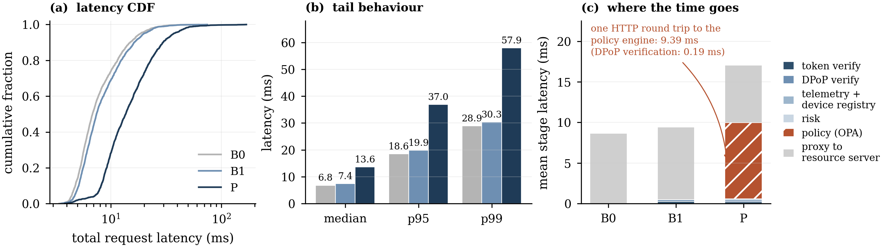

**Figure 7.** Per-request latency. (a) Distribution. (b) Tail percentiles. (c) Where the time goes: DPoP verification costs 0.19 ms, about 1% of a request, while one round trip to the out-of-process policy engine costs 9.39 ms — more than the backend call it guards.

### 9.10 Behaviour under increasing load (RQ3)

**Table 11 — latency and achieved rate versus concurrency.** 30 s per cell, warm-up excluded. Source: `table8_scaling.csv`; plotted in Figure 8.

| Config | Clients | Achieved req/s | p50 (ms) | p95 (ms) | p99 (ms) | mean (ms) |
|---|---|---|---|---|---|---|
| B0 | 5 | 8.37 | 11.09 | 22.37 | 33.38 | 12.04 |
| B0 | 10 | 17.69 | 9.46 | 21.35 | 27.64 | 10.73 |
| B0 | 20 | 35.22 | 6.73 | 19.83 | 27.99 | 8.86 |
| B0 | 40 | 71.48 | 5.30 | 17.29 | 23.63 | 7.54 |
| B1 | 5 | 8.57 | 11.70 | 23.22 | 33.25 | 12.61 |
| B1 | 10 | 18.26 | 9.54 | 21.37 | 29.05 | 10.84 |
| B1 | 20 | 35.65 | 7.23 | 21.55 | 36.04 | 9.62 |
| B1 | 40 | 72.49 | 5.74 | 18.18 | 28.15 | 7.91 |
| P | 5 | 8.89 | 19.54 | 36.59 | 50.71 | 20.78 |
| P | 10 | 17.51 | 14.47 | 35.57 | 48.71 | 17.51 |
| P | 20 | 35.49 | 13.02 | 44.93 | 83.87 | 17.85 |
| P | 40 | 68.06 | 15.38 | 47.40 | 510.76 | 28.00 |

The P − B1 median gap is roughly constant in absolute terms across the range — +7.8, +4.9, +5.8 and +9.6 ms at 5, 10, 20 and 40 clients — so continuous enforcement adds a fixed per-request tax rather than degrading super-linearly over the range tested. Achieved rate differs by at most 6.1% across configurations at 40 clients (B0 71.5, B1 72.5, P 68.1 req/s).

**We make no capacity claim.** The workload is closed-loop with think time and no configuration was driven to saturation, so these are achieved rates under a fixed offered load, not throughput ceilings. Nothing should be read into them beyond "P did not become the bottleneck at the loads tested". P's p99 at 40 clients (510.8 ms) is a tail outlier in a single 30-second cell and we do not interpret it.

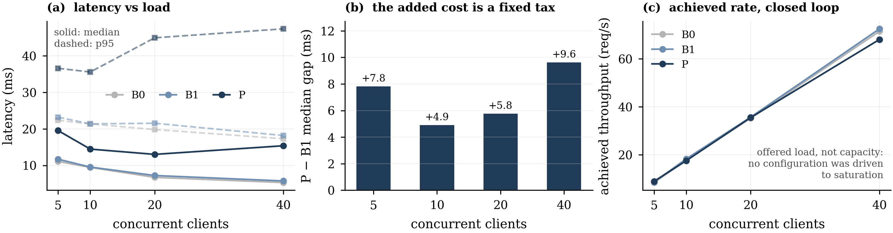

**Figure 8.** Behaviour under increasing offered load. (a) Latency at 5, 10, 20 and 40 concurrent clients. (b) The P − B1 median gap stays within 4.9–9.6 ms across the range: a fixed per-request tax. (c) Achieved rate under a closed-loop workload with think time; no configuration was driven to saturation, so this is not a capacity measurement.

### 9.11 Summary of findings

Against a FAPI 2.0-correct baseline, continuous context-bound enforcement bought one thing on this testbed and did not keep it. It changed the outcome of exactly one of the six primary attacks — account takeover from a newly enrolled device, from 30/30 to 11/30 — and that reduction is a window-bookkeeping transient that an adversary erases by pacing their requests and copying headers, after which they succeed on 30 of 30. It bought nothing at all against device-resident key abuse or volume abuse, the adversaries the contextual layer exists for, because the only rule addressing them fires on 100% of legitimate traffic at 36 times its own threshold. It cost 6.2 ms at the median and 27.6 ms at p99 (δ = 0.58, large), 11.5 points of controller CPU, 5.0 MiB of memory, and refusal of 7.4% of legitimate requests, rising to 97.3% whenever a client's context changes, with the step-up challenge band never used. An ablation attributes the measured security gain to a conjunction in which no component suffices alone, and 100% of the usability cost to the contextual group.

Two constructive results sit alongside the negatives. The enforcement path is sound: with a perfect detector the same pipeline blocks all six attacks, so the gap is detection quality and not architecture. And the defeat of the adaptive adversary is a calibration failure with a validated one-line remedy: lowering `τ_allow` from 0.40 to 0.30 refuses the adaptive adversary on 30 of 30 attempts at both paces and refuses 100% of the naive adversary's requests, at identical measured friction, because the unforgeable evidence the system already collects was priced 0.05 below its own decision threshold.

---

## 10. Security analysis

A functional demonstration is not a security argument. This section separates what the measurement demonstrates, what we argue analytically, and what the design assumes, and then states the residual attack surface.

### 10.1 Demonstrated experimentally

- **O1 and O2 hold under B1 and P.** A1 (30 attempts) and A2 (30 attempts) succeed on 0 of 30 in both, refused at proof verification by the `jti` replay cache and the thumbprint comparison respectively. These are existence results over a finite attempt budget on one implementation, not proofs; the protocol-level guarantees are established elsewhere [3, 4].
- **O3 holds as evidence and fails as a decision.** The device registry reported an unknown key on 100% of A4's and A7's requests and on 0% of 1 920 legitimate requests. As a detector the signal is exact on this workload. At the shipped operating point it never changes a decision on its own, and the adaptive adversary of §9.3 succeeds on every attempt against it.
- **O4 fails for the device-resident regime at every operating point.** §9.6 shows no `τ_allow` separates A3 or A6 from the legitimate workload, because the only rule addressing them fires on all of it.
- **O5 holds, and not because of the enforcement layer.** A5 is refused in all three configurations by the resource server's ownership check.
- **O6 fails.** 7.4% of legitimate requests are refused overall, 97.3% under context drift.
- **The enforcement path is faithful.** Given a correct verdict, the PDP/PEP path converted it into a refusal on 180 of 180 attack requests (§9.8).

### 10.2 Argued analytically, not measured

- **Unforgeability of the device signal.** An adversary in position P4 cannot present the victim's `cnf.jkt` without the corresponding private key, because the identity provider binds the thumbprint of the key used in the token request and the controller verifies the proof signature against the embedded JWK. This rests on the assumed unforgeability of ES256 signatures (§5.3) and on the identity provider behaving correctly; we do not verify it experimentally, and an implementation that failed to compare the recomputed thumbprint would exhibit the same measurements while providing none of the property.
- **Failure mode of the policy engine.** The controller denies when the policy engine is unreachable. We assert this from the code path; we did not measure availability behaviour under policy-engine failure, and we make no claim about the availability consequences of that choice.
- **Key-registry growth.** The per-subject registry is bounded by the number of distinct keys a subject presents, and telemetry by a 60-second window. We reason about this from the data structures; we measured memory only over a 60-second workload with one subject, which does not exercise growth.

### 10.3 Assumed by design

The trust assumptions of §5.3 are assumed, not established. In particular, the resource server accepts requests from the controller on the basis of an internal header on a private network, which is a network-isolation assumption rather than an authenticated channel. An adversary with network access inside the trust boundary bypasses the entire enforcement layer in one step. A production deployment would use mutual TLS between controller and resource server, and we have not evaluated that configuration.

We note the tension deliberately rather than leaving a reviewer to find it: a testbed for Zero Trust enforcement, whose premise is that position inside a network should not confer trust, grants exactly that trust on its own most sensitive internal hop. The assumption is sound as a model of the network isolation a deployment would provide, and it is orthogonal to every result in §9, because no attack in the suite is positioned inside the boundary. It is nonetheless the weakest link in the artefact, and mutual TLS on that hop is on the list of changes in the accompanying assessment.

### 10.4 Residual attack surface and bypass paths

- **The unforgeable signal is priced below the decision threshold.** This is the bypass the measurement found, and it requires no capability beyond §5.2. §9.6's recalibration closes it on this workload; whether it closes on a workload whose legitimate traffic occupies [0.30, 0.40) is an open question that the deployer must answer from their own telemetry.
- **Window-boundary evasion generally.** Both transient signals in §9.2 are properties of a sliding window shared between the baseline-establishing traffic and the adversary's traffic. Any signal defined as a comparison against recent history is erodible by an adversary who is willing to be slow, because their own traffic becomes the history. This generalizes beyond our parameters: it is a property of comparing against a recent window rather than an established baseline.
- **Saturated rules as a covert amplifier.** §9.4 shows an uninformative rule converting challenges into denials. The dual also holds: an adversary who can drive a subject's legitimate rate *down* (for example by waiting for a quiet period) removes the 0.25 contribution and lowers the risk of their own requests. We did not measure this.
- **The first key a subject presents is enrolled unconditionally.** An adversary who reaches a subject before any legitimate request does — a newly provisioned account, or a subject whose state has just been reset — establishes themselves as the baseline. Our harness resets state and then warms up from the enrolled device precisely to avoid measuring this case; a deployment has no such luxury, and enrolment-time trust is out of scope here.
- **Object-level authorization is entirely downstream.** The controller allowed all 30 of A5's requests; the resource server refused them. A deployment whose resource server lacks ownership checks gains nothing from this enforcement layer against P5.
- **Out of scope by assumption**, and therefore residual in any deployment: kernel-level key exfiltration, compromise of the identity provider, attacks on the primitives, denial of service, and attacks on the authorization endpoint, which our measured data path does not exercise.

### 10.5 What we do not claim

We performed no formal verification, no symbolic model checking and no proof of any security property; where formal results are relevant we cite the work that established them [3, 4, 5]. We did not deploy to, or test against, any real bank, real Accredited Data Recipient, production or staging endpoint. We make no statistical claim beyond the intervals and effect sizes of §8.5, and no capacity claim at all.

---

## 11. Discussion

### 11.1 What continuous enforcement adds over FAPI 2.0

The boundary this paper set out to characterize is narrower than the Zero-Trust-for-banking literature implies, and narrower than we expected.

On one side of it the result is clean. A FAPI 2.0-correct deployment already neutralizes the network-interception and browser-exfiltration adversaries that motivate much of the field — completely, and for 0.60 ms at the median, δ = 0.115, and 1.6 points of CPU. For those adversaries a contextual layer is pure cost.

On the other side, the value of the contextual layer is not "it handles the adversaries DPoP cannot". It handled one of them, and only against an adversary who made no attempt to evade it. The distinction that actually predicts whether a contextual layer will help is not "context versus no context" but **whether the adversary is forced to produce evidence they cannot suppress**:

- Account takeover from a new device forces the adversary to present a key the account has never used, because the thumbprint is bound into a token they cannot forge. The evidence is unavoidable, and our system collected it on 100% of requests.
- Device-resident abuse forces nothing. The adversary presents the account's own key from the account's own context, and the only remaining difference is a rate that the account's own clients also exceed.

Our results then add a second distinction that we did not anticipate and consider the more useful of the two: **collecting unavoidable evidence is necessary but not sufficient, because the evidence must also be priced above the decision threshold.** The system in its shipped configuration satisfied the first condition perfectly and the second not at all, and the measured consequence was a defence that observed an adversary on every one of 30 requests and allowed every one of them. A deployer evaluating a contextual layer should ask both questions: what evidence does this adversary have to produce, and is that evidence, on its own, sufficient to change a decision?

The corollary is a caution about how this class of system is evaluated. "Continuous, context-aware enforcement" names an architecture, not a capability. The architecture worked here — the enforcement path converted a correct verdict into a refusal on 180 of 180 requests — and the contextual layer it exists to serve produced an actionable decision on one of six attacks, which then did not survive a trivially adaptive adversary. Evaluations that report an architecture's response to attacks it has been told about (§8.4), or to adversaries who happen to differ from legitimate users along an axis the rule set already watches, or to adversaries who do not adapt, will systematically overstate what the architecture delivers.

### 11.2 Adaptive evaluation is not optional

The gap between our §9.1 result and our §9.3 result is the difference between two numbers for the same attack against the same system: 11/30 and 30/30. Nothing about the system changed. What changed is that the adversary did something that the threat model already permitted and that the evaluation had not exercised.

We would press this as a methodological point for the field rather than as a property of our system. A fixed attack script measures a defence's behaviour on a fixed input distribution. A security claim is a claim about the worst case within the threat model, and the two coincide only if the script happens to contain the worst case. In our case it did not, and the distance between them was the entire result. The cost of finding this was one additional attack module and three minutes of runtime, which is a poor excuse for not having run it.

### 11.3 The cost model, and what a deployer should budget

The added cost is not where design intuition puts it. The cryptography costs 0.19 ms per request, about 1%. The contextual layer's own work — telemetry collection and rule evaluation — costs 0.16 ms. The remaining 9.39 ms, 55% of the mean request and more than the backend call it protects, is one HTTP round trip to an out-of-process policy engine.

For gateway deployment this is the most actionable number in the paper, because it is an architectural choice rather than a property of continuous authorization. A colocated sidecar, an in-process policy library, or a decision cache keyed on the (risk bucket, check outcome) tuple would each remove most of it; the rule set is deterministic and its input space is small, so caching is straightforward. **A deployer should read the P − B1 delta as "one policy round trip", not as "the price of Zero Trust", and budget accordingly.** The resource figures point the same way: 11.5 points of one core for work dominated by serializing a document and awaiting a response.

The scaling sweep supports treating this as a fixed per-request tax over the range tested, with the P − B1 median gap between 4.9 and 9.6 ms from 5 to 40 clients. We did not drive the system to saturation and make no claim about behaviour there.

### 11.4 Usability, and four failure modes that generalize

A defence that refuses 7.4% of legitimate requests, and 97.3% of those from a client that changed network, would be disqualifying in a production Open Banking deployment on its own — before considering that it stops neither of the adversaries it was built for and only transiently stops the third. Four aspects of how it got there generalize beyond our parameter choices, and none produces an error, a failing test or an anomalous metric.

**A per-request geo-velocity rule is the wrong shape.** At request rates measured in milliseconds any change of region implies an impossible velocity, so the rule degenerates into "region changed" and refuses the return leg as readily as the departure — which is why a 3.9% drift rate produced 7.4% friction. Velocity reasoning belongs at session or login granularity, where the elapsed time between observations is long enough for the physics to mean anything, not on every call.

**A rule that fires on everything is not harmless.** The call-rate rule fired on 100% of legitimate requests at 36 times its own threshold and therefore carried no information — and it still changed outcomes, by carrying every geo-velocity event from the challenge band into the deny band (§9.4). In an additive scheme, an uninformative rule is a constant offset that silently re-centres every decision. A rate rule needs a denominator the legitimate population does not routinely exceed: per-device or per-client rather than per-subject, or baseline-relative rather than absolute.

**Trust state must be keyed on a verified claim, and baselines must not be overwritable.** Keying continuous-trust state on a self-reported device header — the obvious choice, since that is where fingerprint and geography arrive — lets an adversary reset every behavioural signal by inventing an identifier, and nothing reports an anomaly, because a new device with no history is exactly what a first-time legitimate user looks like. The same reasoning forces the enrolment policy: auto-enrolling an unrecognized key on first use turns the device signal into a one-request alarm. Our implementation keys on the verified `sub` and `cnf.jkt` for exactly this reason (§6.4) — and §9.2 shows that even a correctly keyed signal is undone if it is compared against a window the adversary's own traffic can fill.

**The adaptive band needs a graded score, and coarse additive penalties do not supply one.** P issued 143 refusals and zero challenges. The measured belief distribution is bimodal at 0.25 and 0.85 and steps over the [0.40, 0.70) window entirely (Figure 4(b)). Step-up authentication is the mechanism that is supposed to make contextual enforcement survivable for legitimate users. This is a design-level observation rather than a tuning one: adaptive enforcement requires a risk signal with populated intermediate values, and six coarse additive penalties do not produce them. It also bears on §3.3 — a belief-threshold policy fitted to this system would be a model of a two-state detector with a degenerate middle action, which is a weaker object than the analytical literature assumes.

### 11.5 Calibration is not a tuning detail

In a system whose penalties are coarse and additive, the operating point does not fine-tune outcomes; it decides them. A 0.10 change in `τ_allow` is the difference between refusing 63% and 100% of a naive account-takeover adversary, and between 0% and 100% of an adaptive one, at identical measured friction. The same sweep shows that no change of operating point affects the device-resident adversary at all.

That asymmetry is the practically useful output of §9.6, and it is available to any deployment that records the risk score on every request. Recomputing the decisions a recorded population would have received under other thresholds costs nothing and separates two failures with entirely different remedies: re-price the signal, or find a different one. We would put this alongside the ablation as standard practice for evaluating this class of system — report the threshold sweep with the operating point, because "the signal is absent" and "the signal is present but priced below the threshold" look identical in a single-operating-point results table, and on this system both occurred, one for each of the two adversaries the contextual layer was built for.

---

## 12. Limitations and threats to validity

**Construct validity.** Attack success is measured as the resource server returning protected data, which is the right construct for "did the adversary obtain protected data" but makes A5 insensitive to the enforcement layer, since ownership is enforced downstream in all three configurations. The geographic signal is synthetic — region codes with an assumed 1 000 km separation, not real geolocation — so §9.4's drift numbers characterize *the rule's shape*, not a real travel workload's false-positive rate. A "challenge" is scored as a refusal for the adversary and as friction for the legitimate user, which is correct for both but conceals that a challenge a real user can satisfy and a denial they cannot are not equally costly.

**Internal validity.** The realm provides a single test identity, so the legitimate workload is one subject with one enrolled device driving 20 concurrent clients, which is what saturates the per-subject call-rate rule (§9.5). A workload spread over many subjects would lower that rule's firing rate on legitimate traffic and could change the shape of the threshold sweep — though not the A3 conclusion, since A3's adversary shares the victim's subject by definition. Each performance and friction cell is a single run; the reported intervals cover sampling variation within a run and not variation between runs, which we did not measure (§8.5). The host is a laptop under Docker Desktop.

**Coverage of the baseline.** The measured data path begins at the resource API, so token verification and DPoP proof verification are exercised on every request but the authorization endpoint is not. PAR and PKCE are configured in the realm and are not on the measured path; the harness and load generator obtain tokens through a direct grant in order to acquire correctly bound tokens without simulating a browser redirect. Our B1 is therefore a faithful comparator for the *sender-constraining* provisions of FAPI 2.0, which is the provision this paper's argument turns on, and not for the profile as a whole. mTLS-based sender-constraining is not evaluated at all, and its per-request cost profile would differ from DPoP's. The `htu` comparison is stricter than RFC 9449 specifies (§7), and DPoP nonces are not implemented.

**Attack coverage.** Seven attacks over five adversary positions is not exhaustive, and the adaptive adversary we implemented is the one our own analysis predicted; a different analysis would predict different evasions. We did not attempt evasions of the geo rule (for example, a drifting adversary who moves and then stays), enrolment-time attacks, or adversaries who manipulate a subject's legitimate traffic rate to lower their own risk (§10.4).

**Generalizability.** Synthetic data and a mock resource server limit external validity: the results characterize authorization-semantic behaviour and per-request cost, not bank-specific data effects. Risk scoring is rule-based by deliberate design choice, for auditability and for the attributability the ablation depends on. A learned detector — which is what [6] suggests for exactly the A3/A6 regime where our rules fail — may well shift the security/false-positive trade-off, and that comparison is left to future work. **Our negative result for A3 and A6 is a result about this rule set at these thresholds on this workload, not about contextual detection in general**; what generalizes is the diagnosis in §9.6 of how to tell the two kinds of failure apart.

**Components not evaluated.** Availability behaviour under policy-engine failure; key-registry growth over long horizons and many subjects; the challenge flow itself, since no legitimate request ever received one and the adversary requests that did were scored simply as refused; refresh-token rotation; and consent scope, which the synthetic dataset carries per user but which the policy never evaluates — so the one authorization check that could have discriminated between configurations at the policy decision point is absent from the measurement (§9.1).

---

## 13. Reproducibility

The testbed, attack suite, load profiles, raw per-request records and analysis pipeline are released (Data Availability). The following is sufficient to reproduce every number in §9.

**One-command bring-up.** `make up` starts the four services from pinned images; `make attacks && make experiments && make scaling && make attacks-oracle && make attacks-adaptive && make ablation && make analysis` reproduces every table and figure from scratch. `make analysis` alone regenerates all tables and figures from the committed raw records without re-running any workload.

**Determinism.** All seeds are fixed (`GLOBAL_SEED = 42` for device keys and the workload's drift draw, `MOCK_ADR_SEED = 42` for the synthetic dataset). Device keys are derived deterministically from the seed, so the victim's enrolled key is identical across runs. Service images are pinned by version tag, and Python dependencies are pinned by exact version in per-service requirement files.

**Single source of truth.** The JSONL records under `data/raw/` are the only input to the analysis. Every table in `data/tables/` and every result figure is generated from them by one script; no value in the manuscript is transcribed by hand from a console. Each diagram's source code names the implementation files it was drawn from.

**Checklist.**

| Item | Value |
|---|---|
| Hardware | Apple M5, 10 cores, 16 GiB RAM |
| Operating system | macOS 26.6.2 (25G83) |
| Container runtime | Docker Engine 29.4.1, Compose 5.1.3 |
| Identity provider | Keycloak 26.4.4, FAPI 2.0 DPoP client policy profile |
| Policy engine | Open Policy Agent 0.70.0 |
| Controller / resource server | Python 3.12, FastAPI 0.115.0, cryptography 43.0.1 |
| Load generator | Locust 2.31.3, host-side, loopback |
| Analysis | Python 3.12.13, numpy 2.1.2, scipy 1.14.1, pandas 2.2.3, matplotlib 3.9.2 |
| Dataset | synthetic; 100 users × 3 accounts × 200 transactions, seed 42 |
| Attack repetitions | 30 attempts per attack per cell |
| Performance workload | 20 clients, 60 s, think time U(0.1, 1.0) s, drift probability 0.05 |
| Scaling workload | 5 / 10 / 20 / 40 clients, 30 s per cell |
| Warm-up exclusion | first 5 s of every run; harness warm-up requests labelled and excluded |
| Thresholds | τ_allow = 0.40, τ_deny = 0.70 (shipped); τ_allow = 0.30 (recalibrated) |
| DPoP parameters | ES256; iat skew ±60 s; jti cache TTL 120 s, 100 000 entries |
| Statistics | Wilson 95% intervals; 2 000-resample percentile bootstrap; Cliff's δ; risk difference with 95% CI; Haldane–Anscombe odds ratio |

**Known reproducibility limits.** Latency and resource figures are host-dependent and will differ on other hardware; the effect sizes and the stage decomposition should not. Each performance cell is a single run, so a replication should expect between-run variation that our intervals do not characterize. The Keycloak realm pins the token subject to the synthetic resource-server user through a hardcoded-claim mapper, so all measured traffic shares one subject by construction (§8.3).

---

## 14. Conclusion

FAPI 2.0's mandatory sender-constraining already neutralizes the network- and theft-based token attacks that motivate much Open Banking security work — completely, and for 0.60 ms per request. That reframes the question for Zero Trust in this setting from "does proof-of-possession help" to "what does continuous, context-bound enforcement add beyond it, at what cost, and against which adversaries."

Measured on a reproducible synthetic testbed with an identical attacker suite across a weak baseline, a FAPI 2.0-correct baseline and a continuous-enforcement system, the delta is narrow, expensive, and — in the part that matters most — not robust. Continuous enforcement changed the outcome of one of six attacks: account takeover from a newly enrolled device, from 30/30 to 11/30. Reading the controller's own per-request records shows those 11 successes to be the exact interval in which the system was relying on unforgeable evidence it had priced below its own decision threshold, flanked by two signals that are artefacts of sliding-window bookkeeping. An adversary who paces their requests and copies the victim's self-reported context — capabilities the threat model already grants — succeeds on 30 of 30, the same as against the baseline with no contextual layer at all. Against device-resident key abuse and volume abuse the system changed nothing at any operating point, because the only rule addressing them fires on 100% of legitimate traffic at 36 times its own threshold. The cost was 6.2 ms at the median and 27.6 ms at p99, 11.5 points of controller CPU, 5.0 MiB of memory, and refusal of 7.4% of legitimate requests — 97.3% of those whose context changed — with the adaptive challenge band never used.

Three results are constructive. First, the enforcement path is sound: given a correct verdict it refused 180 of 180 attack requests, so the gap between the organic result and blocking everything is detector quality, not architecture. Second, the calibration failure has a validated remedy: lowering the challenge threshold from 0.40 to 0.30 refuses the adaptive adversary on 30 of 30 attempts at both paces and 100% of the naive adversary's requests, at identical measured friction, because the system was already collecting the right evidence. Third, the threshold sweep cleanly separates the two ways this class of defence fails — for account takeover the operating point was the binding constraint, for device-resident abuse the signal is — and these have entirely different remedies.

The practical reading for Open Banking deployers is that the per-subject device-key registry is the component worth adopting first, because it is the only one that observes evidence the adversary cannot suppress and it costs nothing measurable, **and that adopting it is useless unless its penalty is priced to be actionable on its own.** Per-request geo-velocity and absolute per-subject call-rate rules should be treated as liabilities until reshaped: here they supplied the entire usability cost and no independent detection, and one of them converted every step-up challenge into an outright denial while carrying no information.

Two methodological points we would press on anyone measuring this class of system. A defence must never be scored on evidence that exists only because the harness knows the request is an attack; with a self-declared attack tag enabled, this same system blocks 6 of 6 attacks instead of 2 of 6, and the difference is invisible in the results table. And a defence must be measured against an adversary who adapts within the stated threat model, because the distance between our non-adaptive and adaptive measurements of the same attack against the same system was 11/30 against 30/30, and closing that distance cost one attack module and three minutes.

Future work: risk signals with denominators that legitimate traffic does not saturate and baselines an adversary's own traffic cannot erode; learned detectors for the device-resident regime where rule-based scoring fails, compared against this baseline rather than against plain bearer OAuth; a colocated or cached policy decision point, which the cost breakdown indicates would remove most of the overhead; evaluation over many subjects and over real travel patterns; and formal analysis of partial-deployment failure modes, for which §9.7's ablation cells provide concrete targets.

---

## Data availability

The testbed source (resource server, identity-provider configuration, Zero Trust controller, policy), the attack suite including the adaptive adversary, the load profiles, the complete raw per-request records, and the analysis and figure pipeline are available at **https://github.com/MIMohit/openbank** (branch `open-bank`). Every table and figure cited in §9 is committed and is regenerated from the raw records by a single command. All data are synthetic and generated by the released scripts.

*A versioned archive should be minted from the submission-time commit and its DOI inserted here before submission; no such deposit exists yet and none is claimed.*

## Ethics and responsible research

All experiments use synthetic data and a locally simulated Accredited Data Recipient API. No real banking system, production or staging endpoint, customer data or credential is involved; the identity provider, policy engine, resource server and every credential are local to the testbed and are published as part of it. The synthetic generator produces no personal or financial information of any kind. The attack implementations target only the authors' own local testbed and are released to enable replication of the defensive evaluation, not as general-purpose offensive tooling; each is a few dozen lines of HTTP client code specific to this testbed's endpoints and configuration. Because no external or third-party system was touched, no vulnerability disclosure is applicable; had any real system been tested, coordinated disclosure would have been followed.

## Declaration of generative AI use

Generative AI tools were used in the preparation of this work: for drafting and editing prose, for implementing and debugging parts of the testbed, attack suite and analysis pipeline, and for reviewing the measurement methodology — including identifying the measurement-integrity defects described in §8.4 and the window-transient analysis in §9.2 that motivated the adaptive adversary of §9.3. All experiments were executed on the authors' own infrastructure. Every number reported in §9 was produced by the released pipeline from recorded measurements and verified against the committed files. Every reference in the list below was verified against Crossref or the primary source. The authors reviewed and take full responsibility for the entire content of this manuscript, including all claims, code and data.

---

## References

Every entry below was verified against Crossref or against the primary source document. Where an entry is a specification or a standards-body publication rather than a peer-reviewed paper, the accessed date is given. No entry is marked `[REFERENCE TO VERIFY]`, because no entry that could not be verified was retained.

[1] European Parliament and Council of the European Union. *Directive (EU) 2015/2366 on payment services in the internal market (PSD2)*. Official Journal of the European Union L 337, 23 December 2015, pp. 35–127.

[2] Australian Competition and Consumer Commission. *Competition and Consumer (Consumer Data Right) Rules 2020*, made under the Competition and Consumer Act 2010 (Cth), Part IVD. Accessed September 2026.

[3] D. Fett, P. Hosseyni and R. Küsters. "An Extensive Formal Security Analysis of the OpenID Financial-Grade API." In *2019 IEEE Symposium on Security and Privacy (S&P)*, pp. 453–471, May 2019. DOI: 10.1109/SP.2019.00067.

[4] P. Hosseyni, R. Küsters and T. Würtele. "Formal Security Analysis of the OpenID FAPI 2.0 Family of Protocols: Accompanying a Standardization Process." *ACM Transactions on Privacy and Security*, 28(1), Article 4, pp. 1–36, November 2024. DOI: 10.1145/3699716.

[5] P. Modesti, L. Freitas, Q. Shotomiwa and A. Almehrej. "Security analysis of the open banking account and transaction API protocol." *Cyber Security and Applications*, 3:100097, 2025. DOI: 10.1016/j.csa.2025.100097.

[6] D. Behbehani, N. Komninos, K. Al-Begain and M. Rajarajan. "Open Banking API Security: Anomalous Access Behaviour." In *2023 International Conference on Innovations in Intelligent Systems and Applications (INISTA)*, pp. 1–4, September 2023. DOI: 10.1109/INISTA59065.2023.10310517.

[7] D. Fett, D. Tonge and J. Heenan. *FAPI 2.0 Security Profile*. OpenID Foundation, Final specification, 22 February 2025. https://openid.net/specs/fapi-security-profile-2_0-final.html. Accessed September 2026.

[8] T. Lodderstedt, B. Campbell, N. Sakimura, D. Tonge and F. Skokan. *OAuth 2.0 Pushed Authorization Requests*. RFC 9126, IETF, September 2021. DOI: 10.17487/RFC9126.

[9] N. Sakimura (Ed.), J. Bradley and N. Agarwal. *Proof Key for Code Exchange by OAuth Public Clients*. RFC 7636, IETF, September 2015. DOI: 10.17487/RFC7636.

[10] B. Campbell, J. Bradley, N. Sakimura and T. Lodderstedt. *OAuth 2.0 Mutual-TLS Client Authentication and Certificate-Bound Access Tokens*. RFC 8705, IETF, February 2020. DOI: 10.17487/RFC8705.

[11] D. Fett, B. Campbell, J. Bradley, T. Lodderstedt, M. Jones and D. Waite. *OAuth 2.0 Demonstrating Proof of Possession (DPoP)*. RFC 9449, IETF, September 2023. DOI: 10.17487/RFC9449.

[12] Keycloak Project. *Keycloak 26.4.0 released*. 30 September 2025. https://www.keycloak.org/2025/09/keycloak-2640-released. Accessed September 2026. (DPoP promoted from preview to fully supported; `fapi-2-dpop-security-profile` and `fapi-2-dpop-message-signing` client policy profiles added, passing the FAPI conformance suite. Release 26.4.4 is the identity provider used in this testbed.)

[13] S. Rose, O. Borchert, S. Mitchell and S. Connelly. *Zero Trust Architecture*. NIST Special Publication 800-207, National Institute of Standards and Technology, August 2020. DOI: 10.6028/NIST.SP.800-207.

[14] O. Borchert, G. Howell, A. Kerman, S. Rose and M. Souppaya. *Implementing a Zero Trust Architecture*. NIST Special Publication 1800-35, National Institute of Standards and Technology, Final, 10 June 2025. DOI: 10.6028/NIST.SP.1800-35.

[15] R. S. Sitorus and B. J. Hutagaol. "Designing a Zero Trust Architecture for Securing API Gateways in Digital Banking Systems." *Journal of Information Systems and Informatics*, 7(3):2589–2601, September 2025. DOI: 10.51519/journalisi.v7i3.1219.

[16] Y. Ge and Q. Zhu. "GAZETA: GAme-Theoretic ZEro-Trust Authentication for Defense Against Lateral Movement in 5G IoT Networks." *IEEE Transactions on Information Forensics and Security*, 19:540–554, 2024. DOI: 10.1109/TIFS.2023.3326975.

[17] Y. Ge, T. Li and Q. Zhu. "Scenario-Agnostic Zero-Trust Defense with Explainable Threshold Policy: A Meta-Learning Approach." arXiv:2303.03349, March 2023. Accepted to IEEE INFOCOM 2023 AidTSP Workshop.

[18] C. Daah, A. Qureshi, I. Awan and S. Konur. "Simulation-based evaluation of advanced threat detection and response in financial industry networks using zero trust and blockchain technology." *Simulation Modelling Practice and Theory*, 138:103027, January 2025. DOI: 10.1016/j.simpat.2024.103027.

[19] M. Jones and N. Sakimura. *JSON Web Key (JWK) Thumbprint*. RFC 7638, IETF, September 2015. DOI: 10.17487/RFC7638.

[20] D. Hardt (Ed.). *The OAuth 2.0 Authorization Framework*. RFC 6749, IETF, October 2012. DOI: 10.17487/RFC6749.

[21] C. Wilson and C. Tam. "Security Challenges in Open Banking: A Systematic Review and Conceptualisation of a Tri-Dimensional Security Framework." *FinTech*, 5(2):38, 2026. DOI: 10.3390/fintech5020038.

[22] C. Daah, A. Qureshi, I. Awan and S. Konur. "Enhancing Zero Trust Models in the Financial Industry through Blockchain Integration: A Proposed Framework." *Electronics*, 13(5):865, February 2024. DOI: 10.3390/electronics13050865.

[23] E. B. Wilson. "Probable Inference, the Law of Succession, and Statistical Inference." *Journal of the American Statistical Association*, 22(158):209–212, June 1927. DOI: 10.1080/01621459.1927.10502953.

[24] N. Cliff. "Dominance statistics: Ordinal analyses to answer ordinal questions." *Psychological Bulletin*, 114(3):494–509, November 1993. DOI: 10.1037/0033-2909.114.3.494.

[25] T. Lodderstedt, J. Bradley, A. Labunets and D. Fett. *Best Current Practice for OAuth 2.0 Security*. RFC 9700, IETF, January 2025. DOI: 10.17487/RFC9700.

[26] V. Bertocci. *JSON Web Token (JWT) Profile for OAuth 2.0 Access Tokens*. RFC 9068, IETF, October 2021. DOI: 10.17487/RFC9068.

---

## List of figures

All figures are generated by the released pipeline. Diagrams are drawn from the implementation and their source names the files they were read from; result figures read only the committed tables and raw records.

| Figure | Content | Section |
|---|---|---|
| 1 | System architecture, trust boundary, six-stage pipeline, and which stages each configuration executes | §6 |
| 2 | Adversary positions, capabilities, the control answering each, assets, trust assumptions and scope, with measured outcomes | §5 |
| 3 | Per-request decision path with every refusal branch and its HTTP status | §6, §7 |
| 4 | (a) the rule set with penalties and measured firing rates; (b) the measured risk distribution against the thresholds | §6.3, §9.4 |
| 5 | Workloads, configuration cells and measurement outputs | §8 |
| 6 | (a) attack success by configuration with Wilson intervals; (b) organic result against the perfect-detector ceiling | §9.1, §9.8 |
| 7 | Latency CDF, tail percentiles, and per-stage decomposition | §9.9 |
| 8 | Latency and achieved rate versus concurrency, and the P − B1 gap | §9.10 |
| 9 | Ablation: security, usability cost, and the trade-off plane | §9.7 |
| 10 | (a) decisions recomputed over the measured risk scores; (b) the adaptive adversary at both operating points | §9.6, §9.3 |
| 11 | A4 and A7 per request, with the rules that fired — the window-transient mechanism | §9.2, §9.3 |
| 12 | Anatomy of the friction on legitimate traffic: the doubled excursion cost, the rule pair behind every refusal, and rate saturation | §9.4 |

## List of tables

| Table | Content | Source file |
|---|---|---|
| 1 | Positioning against the closest prior work | — |
| 2 | Attack success rate by configuration | `table1_taxonomy.csv` |
| 3 | The adaptive adversary across operating points and paces | `table9_adaptive_adversary.csv` |
| 4 | Challenge and deny rates on legitimate traffic by context profile | `table2_false_challenge.csv` |
| 5 | Rule firing rate by population | `table7_risk_components.csv` |
| 6 | Decisions recomputed over the measured risk scores | `table6_threshold_sensitivity.csv` |
| 7 | Ablation: attack success and friction per component | `table5_ablation.csv` |
| 8 | Per-request latency by configuration | `table3_latency.csv` |
| 9 | Mean per-stage latency | `table3_latency.csv` |
| 10 | Controller CPU and memory | `table4_resource_overhead.csv` |
| 11 | Latency and achieved rate versus concurrency | `table8_scaling.csv` |
| — | Effect sizes for every reported comparison | `table_effect_sizes.csv` |
| — | Organic result against the detection ceiling | `table1b_oracle_ceiling.csv` |

---

## Appendix A — parameters

| Parameter | Value | Where set |
|---|---|---|
| `τ_allow` (challenge threshold) | 0.40 shipped; 0.30 recalibrated | controller configuration |
| `τ_deny` (deny threshold) | 0.70 | controller configuration |
| R1 penalty, key does not match `cnf.jkt` | 0.80 | risk module |
| R2 penalty, unknown device key or fingerprint | 0.35 | risk module |
| R3 penalty, implied geo velocity above threshold | 0.60 | risk module |
| R4 penalty, call rate above threshold | 0.25 | risk module |
| R5 penalty, session continuity below threshold | 0.20 | risk module |
| R6 penalty, DPoP-failure rate above threshold | 0.20 | risk module |
| Geo-velocity threshold | 500 km/h over an assumed 1 000 km regional displacement | risk module, telemetry module |
| Call-rate threshold | 30 requests/minute, per subject | risk module |
| Session-continuity threshold | 0.50 | risk module |
| DPoP-failure-rate threshold | 0.10 | risk module |
| Telemetry sliding window | 60 s, per subject | telemetry module |
| DPoP `iat` skew | ±60 s | controller configuration |
| `jti` replay cache | 120 s TTL, 100 000 entries | controller configuration |
| Access-token lifetime | 300 s | identity-provider realm |
| Drift probability, legitimate workload | 0.05 | load generator |
| Adaptive-adversary pace | 2.5 s and 4.0 s between requests | attack module |

## Appendix B — attack-to-adversary map

| Attack | Adversary position | Holds the account's key? | Token bound to their key? | Evidence they cannot suppress |
|---|---|---|---|---|
| A1 network replay | P1 | no | n/a (replayed) | a repeated `jti` |
| A2 token theft without key | P2 | no | no | thumbprint mismatch |
| A3 device-resident abuse | P3 | yes | yes (the victim's) | none in this rule set |
| A4 ATO from a new device | P4 | no (their own) | yes (their own) | a `cnf.jkt` this subject has never used |
| A5 BOLA / BFLA | P5 | own key | own token | the object's owner is not the requester |
| A6 volume abuse | P3 | yes | yes (the victim's) | none in this rule set |
| A7 paced ATO (adaptive) | P4 | no (their own) | yes (their own) | a `cnf.jkt` this subject has never used |
